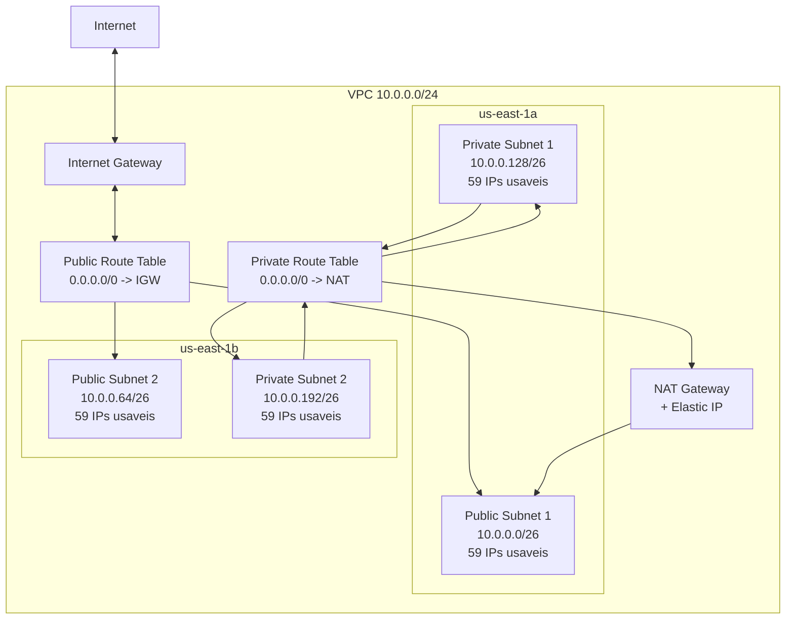

# ADR-002: VPC Network Stack com Public/Private Subnets e Single NAT Gateway

**Status**: Aceito
**Data**: 2026-05-14
**Decisores**: Time de infraestrutura / DevOps lead

---

## Sumario Executivo

Definir a arquitetura de rede VPC para o projeto usando um bloco CIDR /24 (10.0.0.0/24) dividido em 4 subnets /26 distribuidas em 2 Availability Zones (us-east-1a e us-east-1b), com Internet Gateway para subnets publicas e um unico NAT Gateway zonal para acesso de saida das subnets privadas. Este ADR especifica o esquema de subnetting, roteamento, decisoes de custo vs. resiliencia, estrutura de arquivos Terraform (conforme convencoes do projeto), e o mapeamento completo de recursos e variaveis.

---

## Contexto

O projeto precisa de uma VPC para hospedar workloads futuros (ECS, RDS, ALB, Lambda em VPC, etc.). A rede e o recurso fundacional sobre o qual todas as demais stacks serao construidas.

### Requisitos levantados

1. **VPC CIDR**: 10.0.0.0/24 (256 enderecos IP)
2. **2 subnets publicas**: para recursos com acesso direto a internet (ALB, bastion, NAT Gateway)
3. **2 subnets privadas**: para recursos sem IP publico (ECS tasks, RDS, Lambda)
4. **Single NAT Gateway**: para economia de custo, aceitando o trade-off de resiliencia
5. **Multi-AZ**: distribuicao em 2 Availability Zones para alta disponibilidade das aplicacoes

### Alerta: Bloco /24 e limitado

A documentacao AWS (Well-Architected REL02-BP03) recomenda VPCs com CIDR blocks grandes (ate /16) para acomodar crescimento futuro. Um bloco /24 oferece apenas 256 enderecos totais, resultando em subnets /26 com **59 enderecos usaveis por subnet** (64 menos 5 reservados pela AWS). Isso e suficiente para workloads pequenos (workshop, PoCs, ambientes de desenvolvimento), mas **insuficiente para producao com escala**.

**Enderecos reservados pela AWS por subnet** (conforme documentacao oficial):
- `.0`: endereco de rede
- `.1`: VPC router
- `.2`: DNS server
- `.3`: reservado para uso futuro
- `.255` (ou ultimo IP): broadcast (nao suportado, mas reservado)

Para um /26 (64 enderecos), restam **59 enderecos usaveis** por subnet.

---

## Decisao

### Esquema de Subnetting

O bloco 10.0.0.0/24 sera dividido em 4 subnets /26 iguais, cada uma com 64 enderecos (59 usaveis):

| Subnet | Tipo | CIDR | Range | IPs usaveis | AZ |
|---|---|---|---|---|---|
| public-1 | Publica | 10.0.0.0/26 | 10.0.0.0 - 10.0.0.63 | 59 | us-east-1a |
| public-2 | Publica | 10.0.0.64/26 | 10.0.0.64 - 10.0.0.127 | 59 | us-east-1b |
| private-1 | Privada | 10.0.0.128/26 | 10.0.0.128 - 10.0.0.191 | 59 | us-east-1a |
| private-2 | Privada | 10.0.0.192/26 | 10.0.0.192 - 10.0.0.255 | 59 | us-east-1b |

**Logica de divisao**: O /24 foi dividido sequencialmente em 4 blocos /26 contiguos. Publicas primeiro (posicoes 0 e 1), privadas depois (posicoes 2 e 3). Essa ordem e uma convencao comum que facilita a leitura e auditoria do espaco de enderecamento.

**Total**: 256 enderecos alocados, 236 usaveis (4 x 59), 20 reservados pela AWS (4 x 5).

### Arquitetura de Rede

```
                    INTERNET
                       |
                 [Internet Gateway]
                       |
          +------------+------------+
          |                         |
  [Public Subnet 1]        [Public Subnet 2]
   10.0.0.0/26              10.0.0.64/26
   us-east-1a                us-east-1b
          |
    [NAT Gateway]
    (Elastic IP)
          |
          +------------+------------+
          |                         |
  [Private Subnet 1]       [Private Subnet 2]
   10.0.0.128/26            10.0.0.192/26
   us-east-1a                us-east-1b
```

### Componentes

| Componente | Recurso AWS | Finalidade |
|---|---|---|
| VPC | aws_vpc | Rede virtual isolada com DNS support e DNS hostnames habilitados |
| Internet Gateway | aws_internet_gateway | Acesso bidirecional a internet para subnets publicas |
| NAT Gateway | aws_nat_gateway | Acesso de saida para subnets privadas (single, em us-east-1a) |
| Elastic IP | aws_eip | IP estatico para o NAT Gateway |
| Public Subnets (2) | aws_subnet | Subnets com auto-assign public IP, roteadas via IGW |
| Private Subnets (2) | aws_subnet | Subnets sem IP publico, roteadas via NAT Gateway |
| Public Route Table | aws_route_table | Rota 0.0.0.0/0 -> Internet Gateway |
| Private Route Table | aws_route_table | Rota 0.0.0.0/0 -> NAT Gateway |
| Route Table Associations (4) | aws_route_table_association | Associacao de subnets as route tables |

### DNS Configuration

A VPC sera criada com `enable_dns_support = true` e `enable_dns_hostnames = true`. Isso e necessario para:
- Resolucao DNS interna (recursos se comunicarem por hostname)
- Funcionamento de VPC endpoints (futuros)
- Resolucao de nomes de servicos AWS privados (RDS endpoints, etc.)

### Single NAT Gateway: Decisao de custo

O NAT Gateway sera provisionado na **primeira subnet publica (us-east-1a)** como um NAT Gateway zonal padrao. Ambas as subnets privadas roteiam seu trafego de saida por esse unico NAT Gateway.

**Custo estimado de NAT Gateway** (us-east-1):
- Hora de disponibilidade: ~$0.045/hora = ~$32.40/mes por NAT Gateway
- Processamento de dados: ~$0.045/GB

Um unico NAT Gateway economiza ~$32.40/mes em relacao a arquitetura com 2 NAT Gateways (um por AZ). Para um workshop/ambiente de aprendizado, essa economia e relevante.

### Nota sobre Regional NAT Gateway

A AWS lancou recentemente o **Regional NAT Gateway**, que expande automaticamente entre Availability Zones, eliminando a necessidade de criar NAT Gateways separados por AZ e simplificando a arquitetura (nao requer public subnet para hospeda-lo, tem sua propria route table). No entanto, esta feature e relativamente nova e o suporte no Terraform AWS provider pode nao estar completo. **Recomenda-se avaliar a maturidade do suporte Terraform antes da implementacao.** Se o suporte estiver disponivel e estavel, o Regional NAT Gateway seria a opcao preferida, pois oferece HA automatica com um unico recurso.

---

## Estrutura de Arquivos

O codigo Terraform sera organizado no diretorio `terraform/01-network-stack/` com a seguinte estrutura, respeitando integralmente as convencoes definidas em `.claude/rules/terraform-naming.md`:

```
terraform/
  01-network-stack/
    backend.tf                          # Bloco terraform { backend "s3" {} }
    backend.hcl                         # Configuracao do backend S3 via -backend-config
    providers.tf                        # Provider AWS com regiao via variavel e default_tags
    variables.tf                        # Todas as declaracoes de variaveis
    outputs.tf                          # Outputs de VPC, subnets, route tables, NAT/IGW
    vpc.tf                              # Recurso aws_vpc
    vpc.internet-gateway.tf             # Recurso aws_internet_gateway
    vpc.public-subnets.tf               # Recursos aws_subnet publicas (count = 2)
    vpc.private-subnets.tf              # Recursos aws_subnet privadas (count = 2)
    vpc.nat-gateway.tf                  # Recursos aws_eip + aws_nat_gateway
    vpc.public-route-table.tf           # Recurso aws_route_table + aws_route + associations publicas
    vpc.private-route-table.tf          # Recurso aws_route_table + aws_route + associations privadas
    terraform.tfvars                    # Valores das variaveis
```

**Total: 13 arquivos**

> **Nota**: Nao ha `locals.tf` neste modulo. Tags cross-cutting (Project, Environment, ManagedBy) sao definidas via `default_tags` no bloco `provider` em `providers.tf`, eliminando a necessidade de `merge(local.common_tags, ...)` em cada recurso. Nao ha `data.tf` porque nao existem data sources compartilhados neste modulo.

---

### Detalhamento de Cada Arquivo

#### 1. `backend.tf`

```hcl
terraform {
  required_version = ">= 1.5.0"

  required_providers {
    aws = {
      source  = "hashicorp/aws"
      version = ">= 5.0"
    }
  }

  backend "s3" {}
}
```

#### 2. `backend.hcl`

```hcl
bucket       = "workshop-terraform-state2"
key          = "01-network-stack/terraform.tfstate"
region       = "us-east-1"
use_lockfile = true
encrypt      = true
```

Executado com: `terraform init -backend-config=backend.hcl`

#### 3. `providers.tf`

```hcl
provider "aws" {
  region = var.region

  default_tags {
    tags = {
      Project     = var.project_name
      Environment = var.environment
      ManagedBy   = "terraform"
    }
  }
}
```

#### 4. `variables.tf`

Seguindo a convencao de agrupamento em objetos estruturados:

```hcl
variable "region" {
  description = "AWS region for all resources"
  type        = string
}

variable "environment" {
  description = "Deployment environment (e.g., production, staging)"
  type        = string
}

variable "project_name" {
  description = "Project name used for tagging and resource naming"
  type        = string
}

variable "vpc" {
  description = "VPC configuration including all related sub-resource names and settings"
  type = object({
    name       = string
    cidr_block = string

    dns_support_enabled   = optional(bool, true)
    dns_hostnames_enabled = optional(bool, true)

    internet_gateway = object({
      name = string
    })

    public_subnets = object({
      name               = string
      cidr_blocks        = list(string)
      availability_zones = list(string)
    })

    private_subnets = object({
      name               = string
      cidr_blocks        = list(string)
      availability_zones = list(string)
    })

    nat_gateway = object({
      name     = string
      eip_name = string
    })

    public_route_table = object({
      name = string
    })

    private_route_table = object({
      name = string
    })
  })
}
```

**Justificativas das decisoes na variavel `vpc`:**

- `dns_support_enabled` e `dns_hostnames_enabled` com default `true` porque a grande maioria dos workloads AWS requer DNS funcional (RDS, ECS service discovery, VPC endpoints).
- `public_subnets` e `private_subnets` usam nomes no plural porque contem `list(string)` para CIDR blocks e AZs, conforme convencao do projeto.
- `nat_gateway` inclui `eip_name` para permitir tageamento do Elastic IP associado.
- Todas as configuracoes de nomeacao de recursos ficam centralizadas neste objeto, evitando hard-coded strings nos arquivos de recurso.

#### 5. `outputs.tf`

```hcl
output "this_vpc_id" {
  description = "The ID of the VPC"
  value       = aws_vpc.this.id
}

output "this_vpc_cidr_block" {
  description = "The CIDR block of the VPC"
  value       = aws_vpc.this.cidr_block
}

output "public_subnet_ids" {
  description = "List of public subnet IDs"
  value       = aws_subnet.public[*].id
}

output "public_subnet_cidr_blocks" {
  description = "List of public subnet CIDR blocks"
  value       = aws_subnet.public[*].cidr_block
}

output "private_subnet_ids" {
  description = "List of private subnet IDs"
  value       = aws_subnet.private[*].id
}

output "private_subnet_cidr_blocks" {
  description = "List of private subnet CIDR blocks"
  value       = aws_subnet.private[*].cidr_block
}

output "this_internet_gateway_id" {
  description = "The ID of the Internet Gateway"
  value       = aws_internet_gateway.this.id
}

output "this_nat_gateway_id" {
  description = "The ID of the NAT Gateway"
  value       = aws_nat_gateway.this.id
}

output "this_nat_gateway_public_ip" {
  description = "The public IP address of the NAT Gateway"
  value       = aws_nat_gateway.this.public_ip
}

output "public_route_table_id" {
  description = "The ID of the public route table"
  value       = aws_route_table.public.id
}

output "private_route_table_id" {
  description = "The ID of the private route table"
  value       = aws_route_table.private.id
}
```

#### 6. `vpc.tf`

```hcl
resource "aws_vpc" "this" {
  cidr_block           = var.vpc.cidr_block
  enable_dns_support   = var.vpc.dns_support_enabled
  enable_dns_hostnames = var.vpc.dns_hostnames_enabled

  tags = {
    Name = var.vpc.name
  }
}
```

#### 7. `vpc.internet-gateway.tf`

```hcl
resource "aws_internet_gateway" "this" {
  vpc_id = aws_vpc.this.id

  tags = {
    Name = var.vpc.internet_gateway.name
  }
}
```

#### 8. `vpc.public-subnets.tf`

```hcl
resource "aws_subnet" "public" {
  count = length(var.vpc.public_subnets.cidr_blocks)

  vpc_id                  = aws_vpc.this.id
  cidr_block              = var.vpc.public_subnets.cidr_blocks[count.index]
  availability_zone       = var.vpc.public_subnets.availability_zones[count.index]
  map_public_ip_on_launch = true

  tags = {
    Name = "${var.vpc.public_subnets.name}-${count.index + 1}"
  }
}
```

#### 9. `vpc.private-subnets.tf`

```hcl
resource "aws_subnet" "private" {
  count = length(var.vpc.private_subnets.cidr_blocks)

  vpc_id            = aws_vpc.this.id
  cidr_block        = var.vpc.private_subnets.cidr_blocks[count.index]
  availability_zone = var.vpc.private_subnets.availability_zones[count.index]

  tags = {
    Name = "${var.vpc.private_subnets.name}-${count.index + 1}"
  }
}
```

#### 10. `vpc.nat-gateway.tf`

```hcl
resource "aws_eip" "nat" {
  domain = "vpc"

  tags = {
    Name = var.vpc.nat_gateway.eip_name
  }

  depends_on = [aws_internet_gateway.this]
}

resource "aws_nat_gateway" "this" {
  allocation_id = aws_eip.nat.id
  subnet_id     = aws_subnet.public[0].id

  tags = {
    Name = var.vpc.nat_gateway.name
  }

  depends_on = [aws_internet_gateway.this]
}
```

> **Nota**: O NAT Gateway e criado na primeira subnet publica (`public[0]` = us-east-1a). O `depends_on` no Internet Gateway e uma best practice documentada pela AWS e pelo Terraform provider — o NAT Gateway requer que o IGW esteja funcional antes de ser provisionado. O EIP tambem depende do IGW por razao analoga.

#### 11. `vpc.public-route-table.tf`

```hcl
resource "aws_route_table" "public" {
  vpc_id = aws_vpc.this.id

  tags = {
    Name = var.vpc.public_route_table.name
  }
}

resource "aws_route" "public_internet" {
  route_table_id         = aws_route_table.public.id
  destination_cidr_block = "0.0.0.0/0"
  gateway_id             = aws_internet_gateway.this.id
}

resource "aws_route_table_association" "public" {
  count = length(var.vpc.public_subnets.cidr_blocks)

  subnet_id      = aws_subnet.public[count.index].id
  route_table_id = aws_route_table.public.id
}
```

#### 12. `vpc.private-route-table.tf`

```hcl
resource "aws_route_table" "private" {
  vpc_id = aws_vpc.this.id

  tags = {
    Name = var.vpc.private_route_table.name
  }
}

resource "aws_route" "private_nat" {
  route_table_id         = aws_route_table.private.id
  destination_cidr_block = "0.0.0.0/0"
  nat_gateway_id         = aws_nat_gateway.this.id
}

resource "aws_route_table_association" "private" {
  count = length(var.vpc.private_subnets.cidr_blocks)

  subnet_id      = aws_subnet.private[count.index].id
  route_table_id = aws_route_table.private.id
}
```

> **Nota sobre single route table para privadas**: Uma unica route table privada e usada para ambas as subnets privadas. Isso e possivel e correto porque ambas apontam para o mesmo NAT Gateway. Se no futuro a arquitetura migrar para NAT Gateway por AZ, sera necessario criar route tables separadas por AZ.

#### 13. `terraform.tfvars`

```hcl
region       = "us-east-1"
environment  = "production"
project_name = "workshop"

vpc = {
  name       = "workshop-vpc"
  cidr_block = "10.0.0.0/24"

  internet_gateway = {
    name = "workshop-igw"
  }

  public_subnets = {
    name               = "workshop-public"
    cidr_blocks        = ["10.0.0.0/26", "10.0.0.64/26"]
    availability_zones = ["us-east-1a", "us-east-1b"]
  }

  private_subnets = {
    name               = "workshop-private"
    cidr_blocks        = ["10.0.0.128/26", "10.0.0.192/26"]
    availability_zones = ["us-east-1a", "us-east-1b"]
  }

  nat_gateway = {
    name     = "workshop-nat"
    eip_name = "workshop-nat-eip"
  }

  public_route_table = {
    name = "workshop-public-rt"
  }

  private_route_table = {
    name = "workshop-private-rt"
  }
}
```

---

## Diagrama Mermaid



---

## Justificativa

### 1. Divisao em /26 iguais

Dividir o /24 em 4 blocos /26 iguais e a abordagem mais simples e previsivel. Alternativas como blocos assimetricos (/27 para publicas + /26 para privadas) adicionam complexidade sem beneficio real, dado que o espaco total e tao limitado (256 enderecos).

### 2. NAT Gateway zonal (single) ao inves de um por AZ

Um unico NAT Gateway reduz o custo mensal em ~$32.40. Para um projeto de workshop/aprendizado, este trade-off e aceitavel. O NAT Gateway e provisionado na mesma AZ do primeiro grupo de subnets (us-east-1a), o que otimiza o custo de transferencia de dados intra-AZ para a subnet privada nessa AZ.

**Impacto**: Se us-east-1a ficar indisponivel, os recursos na private-2 (us-east-1b) perdem acesso de saida a internet. Os recursos publicos em us-east-1b continuam funcionando via Internet Gateway.

### 3. DNS support e hostnames habilitados

A documentacao AWS recomenda habilitar ambos para a maioria dos workloads. Necessario para:
- Endpoints de RDS resolverem via DNS
- Service discovery do ECS
- VPC endpoints (Interface type) funcionarem corretamente
- Resolucao interna de hostnames de EC2 instances

### 4. Rotas separadas via `aws_route` (e nao inline no `aws_route_table`)

Definir rotas como recursos separados (`aws_route`) ao inves de blocos `route {}` inline no `aws_route_table` e a pratica recomendada pelo Terraform AWS provider. Rotas inline podem causar conflitos quando gerenciadas por multiplos processos e dificultam o gerenciamento do lifecycle.

### 5. `map_public_ip_on_launch` apenas nas subnets publicas

Subnets publicas recebem IP publico automaticamente para recursos que nao usam Elastic IP (ex: instancias de teste, bastion). Subnets privadas nunca devem ter essa opcao habilitada.

---

## Alternativas Consideradas

### Por que nao /28 para publicas + /25 para privadas (subnetting assimetrico)

- **Descartado porque**: Com um espaco total de /24, otimizar a alocacao entre publicas e privadas traz ganho marginal (diferenca de poucos IPs). A divisao igual em /26 e mais legivel, auditavel e previsivel. Subnets /28 teriam apenas 11 IPs usaveis, o que pode ser insuficiente se o ALB precisar de IPs para ENIs em cada AZ.
- **Quando reconsiderar**: Se a VPC migrar para um CIDR maior (/16), a distribucao assimetrica pode fazer sentido.

### Por que nao NAT Gateway por AZ (high availability)

- **Descartado porque**: Adiciona ~$32.40/mes de custo fixo para um segundo NAT Gateway. Para um ambiente de workshop/aprendizado, o impacto de perda de conectividade de saida em uma AZ e aceitavel. Alem disso, com um /24 e apenas 59 IPs usaveis por subnet, o volume de trafego sera baixo.
- **Quando reconsiderar**: Quando o projeto evoluir para producao real com SLAs de disponibilidade. Nesse cenario, criar um NAT Gateway por AZ com route tables separadas por AZ.

### Por que nao Regional NAT Gateway

- **Considerado e potencialmente preferido**: A AWS lancou o Regional NAT Gateway, que expande automaticamente entre AZs, nao requer public subnet, e oferece HA automatica. E a opcao que a AWS recomenda para novos workloads publicos.
- **Descartado nesta fase porque**: (1) Feature relativamente nova — a maturidade do suporte no Terraform AWS provider precisa ser validada; (2) Para um workshop, a simplicidade do NAT Gateway zonal classico facilita o aprendizado e a compreensao da arquitetura de rede.
- **Quando reconsiderar**: Imediatamente apos validar suporte estavel no Terraform AWS provider. Se suportado, migrar para Regional NAT Gateway e altamente recomendado, pois elimina o trade-off de single point of failure sem custo adicional significativo.

### Por que nao VPC Endpoints (Gateway) para S3/DynamoDB

- **Nao descartado, apenas adiado**: VPC endpoints reduzem custo de NAT Gateway (trafego para S3/DynamoDB nao passa pelo NAT) e aumentam seguranca (trafego permanece na rede AWS).
- **Razao do adiamento**: Este ADR foca na fundacao de rede. VPC endpoints serao adicionados quando workloads especificos forem definidos, em arquivos como `vpc.endpoints.tf` ou em uma stack separada.

### Por que nao subnets em 3 AZs

- **Descartado porque**: Com um /24, dividir em 6 subnets (3 publicas + 3 privadas) resultaria em /27 com apenas 27 IPs usaveis por subnet (32 - 5). 2 AZs ja oferecem redundancia adequada para o escopo do workshop.
- **Quando reconsiderar**: Se o CIDR for expandido para /16 e o workload exigir distribuicao em 3+ AZs (ex: EKS com 3 AZs para etcd quorum).

### Por que nao usar o modulo `terraform-aws-modules/vpc/aws`

- **Descartado porque**: O projeto e um workshop com foco educacional. Usar modulos prontos esconde a complexidade dos recursos e dificulta o aprendizado. Recursos nativos (sem modulos) tornam a arquitetura transparente e auditavel.
- **Quando reconsiderar**: Para projetos de producao com equipes que priorizam produtividade sobre aprendizado, o modulo oficial e uma alternativa solida e bem mantida.

---

## Riscos e Trade-offs

| Risco | Mitigacao | Severidade |
|---|---|---|
| Espaco de IP insuficiente (/24 = 256 IPs) | Aceito para workshop. Para producao, usar /16 com secondary CIDR blocks se necessario | Media (aceita) |
| Single NAT Gateway = SPOF para saida das subnets privadas | Aceito para workshop. Documentar procedimento para adicionar segundo NAT Gateway | Media (aceita) |
| Custo de trafego cross-AZ via NAT Gateway | Subnet private-2 (us-east-1b) envia trafego cross-AZ para o NAT em us-east-1a. Custo adicional de ~$0.01/GB | Baixa (aceita) |
| NAT Gateway indisponivel se AZ us-east-1a cair | Recursos privados em ambas as AZs perdem saida para internet. Recursos publicos nao sao afetados | Media (aceita) |
| Subnets /26 podem nao comportar EKS (pods consomem IPs) | Nao usar EKS neste CIDR. Se necessario, usar secondary CIDR block ou IPv6 para pods | Alta (mitigada por escopo) |
| Elastic IP orfao se NAT Gateway for destruido | EIP tem custo quando nao associado (~$3.60/mes). Garantir que EIP e NAT sao gerenciados juntos | Baixa (mitigada) |

### Trade-off aceito: Custo vs. Resiliencia

A escolha de single NAT Gateway prioriza custo (~$32.40/mes de economia) sobre resiliencia de saida em cenario de falha de AZ. Para o contexto de workshop, este trade-off e aceitavel e bem documentado. A migracao para NAT Gateway por AZ (ou Regional NAT Gateway) requer:
1. Criar segundo NAT Gateway (ou Regional)
2. Criar segunda route table privada (uma por AZ) no caso zonal
3. Reasociar subnets privadas as route tables corretas

---

## Conformidade com Convencoes do Projeto

Checklist de validacao contra `.claude/rules/terraform-naming.md`:

- [x] Arquivos seguem `<resource>.<sub-resource>.tf` (ex: `vpc.internet-gateway.tf`, `vpc.public-subnets.tf`)
- [x] Identificadores Terraform usam `_` (underscore), nunca `-` (dash)
- [x] Nomes de recursos nao repetem o tipo (ex: `aws_vpc "this"`, nao `aws_vpc "vpc"`)
- [x] Substantivos singulares para nomes de recursos unicos (`this`), plural para contaveis (`public`, `private`)
- [x] Zero hard-coded strings em argumentos de recursos — tudo via `var.vpc.*`
- [x] Variaveis relacionadas agrupadas em `object()` (ex: `var.vpc.public_subnets.cidr_blocks`)
- [x] Toda variavel e output tem `description`
- [x] `count` e o primeiro argumento em resource blocks que o utilizam
- [x] `tags` contem apenas tags resource-specific (`Name`); cross-cutting via `default_tags`
- [x] Outputs seguem `{name}_{type}_{attribute}` (ex: `this_vpc_id`, `public_subnet_ids`)
- [x] Booleans com nomes positivos (`dns_support_enabled`, `dns_hostnames_enabled`)
- [x] Variaveis do tipo `list(...)` usam nomes no plural (`public_subnets`, `private_subnets`)
- [x] Arquivos padrao presentes (`variables.tf`, `outputs.tf`, `providers.tf`, `backend.tf`, `terraform.tfvars`)
- [x] `default_tags` configurado no provider com `Project`, `Environment`, `ManagedBy`
- [x] Nenhum uso de `merge(local.common_tags, ...)` — tags cross-cutting via `default_tags`
- [x] Backend configurado via `backend.hcl` com key `01-network-stack/terraform.tfstate`

---

## Proximos Passos

1. **Validar este ADR** com o time, especialmente o trade-off de single NAT Gateway e o tamanho do CIDR /24.
2. **Criar os 13 arquivos** listados na estrutura, seguindo o codigo especificado em cada secao.
3. **Executar o deploy**: `terraform init -backend-config=backend.hcl && terraform plan && terraform apply`.
4. **Avaliar Regional NAT Gateway**: verificar suporte no Terraform AWS provider e considerar migracao se estavel.
5. **Planejar VPC Endpoints**: adicionar Gateway Endpoints para S3 e DynamoDB quando workloads forem definidos.

---

## Revisao Recomendada

Reavaliar esta decisao quando:

- O projeto migrar de workshop para producao (substituir single NAT por NAT por AZ ou Regional NAT Gateway).
- Workloads exigirem mais de 59 IPs usaveis por subnet (adicionar secondary CIDR block ao VPC ou migrar para VPC com /16).
- EKS for considerado como workload (pods consomem IPs em escala; avaliar IPv6 ou secondary CIDR com /16).
- O Terraform AWS provider oferecer suporte estavel ao Regional NAT Gateway (migrar para eliminar SPOF).
- VPC Peering ou Transit Gateway forem necessarios (validar que o CIDR 10.0.0.0/24 nao conflita com outras redes).
