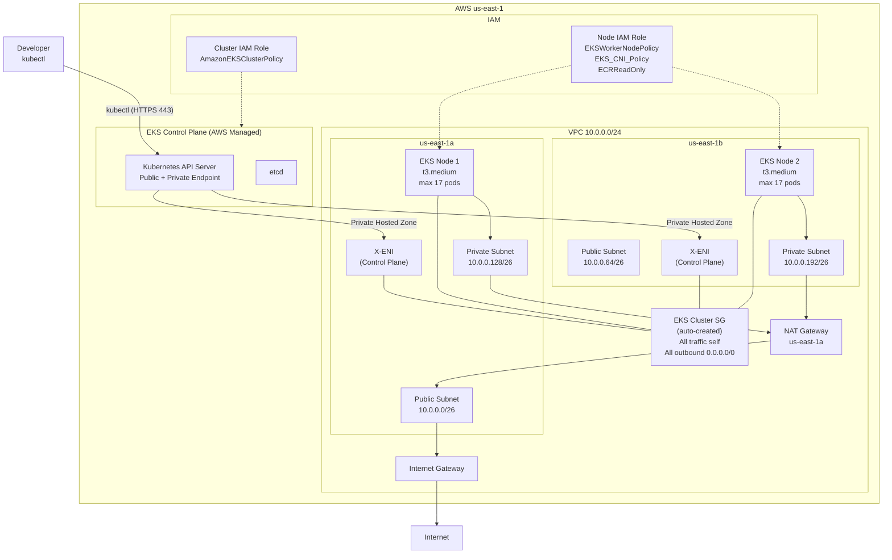

# ADR-003: EKS Cluster com EC2 Managed Node Group em Private Subnets

**Status**: Aceito
**Data**: 2026-05-14
**Decisores**: Time de infraestrutura / DevOps lead

---

## Sumario Executivo

Definir a arquitetura de um cluster Amazon EKS com EC2 Managed Node Group (2 nodes t3.medium on-demand) deployado em subnets privadas da VPC existente (01-network-stack). Este ADR documenta a configuracao do cluster, IAM roles, security groups, endpoint de API, estrategia de IP management com VPC CNI, e as restricoes criticas do CIDR /24 para workloads Kubernetes. Inclui estrutura completa de arquivos Terraform conforme convencoes do projeto.

---

## Contexto

O projeto precisa de um cluster Kubernetes gerenciado para hospedar workloads containerizados. O EKS foi escolhido como servico gerenciado pela AWS, eliminando a necessidade de gerenciar o control plane.

### Dependencias

Este stack depende diretamente do `01-network-stack` e herda suas restricoes:

- **VPC**: 10.0.0.0/24 (256 enderecos totais)
- **Private subnets**: 10.0.0.128/26 (us-east-1a) e 10.0.0.192/26 (us-east-1b) -- 59 IPs usaveis por subnet
- **NAT Gateway**: Single, em us-east-1a (necessario para nodes privados acessarem ECR, EKS API, etc.)
- **Remote state**: S3 bucket `workshop-terraform-state2`, key `01-network-stack/terraform.tfstate`

### Alerta critico: Restricao de IPs com VPC CNI

O Amazon VPC CNI atribui um IP da VPC a cada Pod. Com subnets /26 (59 IPs usaveis), a capacidade e severamente limitada:

**t3.medium sem prefix delegation (modo padrao):**
- 3 ENIs maximo
- 6 IPv4 por ENI
- Formula: (3 x 6) - 3 (IPs primarios) = **15 IPs secundarios disponiveis por node**
- Max pods padrao EKS: **17 por node** (15 + 2 host-networking pods)
- 2 nodes = **34 pods maximo no cluster** (incluindo pods de sistema como kube-proxy, CoreDNS, VPC CNI)

**Consumo de IPs na subnet (sem prefix delegation):**
- Cada node consome 1 IP primario + ate 15 IPs secundarios (warm pool) = ate 16 IPs por node
- 2 nodes = ate 32 IPs consumidos de 59 disponiveis por subnet
- EKS control plane ENIs (X-ENIs): 2-4 ENIs adicionais na subnet = 2-4 IPs adicionais
- **Margem restante: ~23-25 IPs por subnet** -- funcional para workshop, inviavel para escala

**t3.medium com prefix delegation (/28 prefixes):**
- 3 ENIs x 6 slots = 18 slots, menos 3 primarios = 15 slots para prefixes
- Cada /28 prefix = 16 IPs contiguos
- Maximo teorico: 15 x 16 = **240 IPs por node** (limitado a 110 max pods pelo EKS)
- **PROBLEMA**: Cada /28 prefix consome 16 IPs contiguos da subnet. Com apenas 59 IPs usaveis por subnet, um unico node com 1 prefix ja consome 16 IPs (27% da subnet)
- Fragmentacao da subnet torna alocacao de blocos /28 contiguos dificil

**Decisao**: Usar o modo padrao do VPC CNI (sem prefix delegation) para este workshop. O espaco de IP e suficiente para workloads educacionais (~17 pods por node). Prefix delegation em subnets /26 e arriscado pela fragmentacao e esgotamento rapido.

Conforme documentacao AWS (EKS Best Practices - Optimizing IP Address Utilization): "We strongly recommend sizing your VPCs and subnets with growth in mind." A AWS recomenda subnets de pelo menos /19 para EKS. O /26 deste workshop esta 8.192x menor que a recomendacao.

---

## Decisao

### Arquitetura do Cluster

| Componente | Configuracao | Justificativa |
|---|---|---|
| Cluster EKS | Kubernetes managed control plane | Controle total sobre nodes, sem custo de gerenciamento do control plane |
| Node Group | EC2 Managed Node Group | Lifecycle automatizado (drain, update, scaling) gerenciado pela AWS |
| Instance Type | t3.medium (2 vCPU, 4 GiB RAM) | Suficiente para workshop; burstable; suporta Nitro (necessario para EKS) |
| Capacity Type | On-Demand | Estabilidade para ambiente de aprendizado; sem interrupcoes de Spot |
| Node Count | 2 (min=2, max=2, desired=2) | Distribuicao em 2 AZs; fixo para controle de custo |
| Subnets | Private (10.0.0.128/26 e 10.0.0.192/26) | Nodes sem IP publico; saida via NAT Gateway |
| API Endpoint | Public + Private | Acesso externo via kubectl + comunicacao node-to-API via rede privada |
| VPC CNI Mode | Padrao (secondary IPs, sem prefix delegation) | Compativel com subnets /26; evita fragmentacao |

### Diagrama da Arquitetura

```
                         INTERNET
                            |
                     [EKS API Endpoint]
                     (Public + Private)
                            |
            +---------------+---------------+
            |                               |
     [Public Subnet 1]              [Public Subnet 2]
      10.0.0.0/26                    10.0.0.64/26
      us-east-1a                     us-east-1b
            |
      [NAT Gateway]
            |
            +---------------+---------------+
            |                               |
     [Private Subnet 1]             [Private Subnet 2]
      10.0.0.128/26                  10.0.0.192/26
      us-east-1a                     us-east-1b
            |                               |
     [EKS Node 1]                    [EKS Node 2]
      t3.medium                      t3.medium
      (max 17 pods)                  (max 17 pods)
            |                               |
     [EKS Control Plane ENIs]       [EKS Control Plane ENIs]
      (2-4 X-ENIs)                   (managed by AWS)
```

### Componentes AWS

| Componente | Recurso AWS / Terraform | Finalidade |
|---|---|---|
| Cluster EKS | aws_eks_cluster | Cluster Kubernetes gerenciado |
| Cluster IAM Role | aws_iam_role + aws_iam_role_policy_attachment | Role assumida pelo servico EKS para gerenciar o cluster |
| Node Group | aws_eks_node_group | Managed node group com EC2 Auto Scaling Group |
| Node IAM Role | aws_iam_role + aws_iam_role_policy_attachment (x3) | Role assumida pelas instancias EC2 para comunicar com EKS e ECR |
| Cluster Security Group | (gerenciado automaticamente pelo EKS) | SG default criado pelo EKS com regras de comunicacao cluster-node |
| Network State | terraform_remote_state | Leitura de subnet IDs e VPC ID do 01-network-stack |

### IAM Roles

#### Cluster IAM Role

| Aspecto | Configuracao |
|---|---|
| Trust Policy | Service: `eks.amazonaws.com` / Action: `sts:AssumeRole` |
| Managed Policy | `arn:aws:iam::aws:policy/AmazonEKSClusterPolicy` |

Conforme documentacao AWS (Amazon EKS cluster IAM role): o `AmazonEKSClusterPolicy` e obrigatorio e inclui permissoes para gerenciar nodes (ec2:CreateTags, ec2:DescribeInstances, etc.) e opcionalmente criar load balancers via legacy Cloud Provider.

#### Node IAM Role

| Aspecto | Configuracao |
|---|---|
| Trust Policy | Service: `ec2.amazonaws.com` / Action: `sts:AssumeRole` |
| Managed Policy 1 | `arn:aws:iam::aws:policy/AmazonEKSWorkerNodePolicy` |
| Managed Policy 2 | `arn:aws:iam::aws:policy/AmazonEKS_CNI_Policy` |
| Managed Policy 3 | `arn:aws:iam::aws:policy/AmazonEC2ContainerRegistryReadOnly` |

**Nota sobre `AmazonEKS_CNI_Policy` na node role**: A AWS recomenda mover esta policy para uma role separada via IRSA (IAM Roles for Service Accounts) associada ao service account `aws-node`. No entanto, para um workshop, manter na node role simplifica a configuracao sem impacto de seguranca significativo. A documentacao AWS (Amazon EKS node IAM role) confirma que esta abordagem e funcional, embora nao seja a best practice para producao.

**Nota sobre `AmazonEC2ContainerRegistryReadOnly` vs `AmazonEC2ContainerRegistryPullOnly`**: A AWS recomenda `AmazonEC2ContainerRegistryPullOnly` para novas implementacoes (mais restritiva). Para compatibilidade ampla com workshops e imagens publicas, `AmazonEC2ContainerRegistryReadOnly` e aceitavel. Ambas sao validas.

### Security Groups

O EKS cria automaticamente um security group default (`eks-cluster-sg-<cluster-name>-<uniqueID>`) com as seguintes regras (conforme documentacao AWS - View Amazon EKS security group requirements):

| Tipo | Protocolo | Portas | Origem/Destino |
|---|---|---|---|
| Inbound | All | All | Self (o proprio SG) |
| Outbound | All | All | 0.0.0.0/0 |

Este SG e automaticamente associado a:
- 2-4 ENIs do control plane (X-ENIs) criadas na VPC
- ENIs dos nodes do managed node group

**Decisao**: Nao criar security groups customizados nesta fase. O SG default do EKS permite comunicacao irrestrita entre control plane e nodes, o que e suficiente e seguro para um workshop. Para producao, as regras minimas requeridas sao:
- TCP 443 (HTTPS para Kubernetes API)
- TCP 10250 (kubelet API)
- TCP/UDP 53 (DNS / CoreDNS)

### API Endpoint Access

| Configuracao | Valor | Justificativa |
|---|---|---|
| Public Access | `true` | Permite acesso ao kubectl de fora da VPC (maquina do desenvolvedor) |
| Private Access | `true` | Nodes comunicam com o API server via rede privada (Route 53 private hosted zone) |
| Public Access CIDRs | `["0.0.0.0/0"]` | Sem restricao de IP para workshop; em producao, restringir ao IP do time |

Conforme documentacao AWS (Cluster API server endpoint): quando private access e habilitado, o EKS cria uma Route 53 private hosted zone que requer `enableDnsHostnames` e `enableDnsSupport` habilitados na VPC. Ambos ja estao habilitados no 01-network-stack (ADR-002).

### Subnet Tags para Kubernetes

As subnets privadas do 01-network-stack precisam de tags adicionais para o EKS. Estas tags **devem ser adicionadas neste stack** (02-eks-stack) usando data sources, nao modificando o 01-network-stack:

| Tag | Valor | Subnet | Finalidade |
|---|---|---|---|
| `kubernetes.io/role/internal-elb` | `1` | Private subnets | Permite que o AWS Load Balancer Controller crie internal ALBs |
| `kubernetes.io/cluster/<cluster-name>` | `shared` | Private subnets | Identifica subnets pertencentes ao cluster |

**Nota**: A tag `kubernetes.io/cluster/<cluster-name>` nas subnets nao e mais obrigatoria para EKS >= 1.19, mas e necessaria para o AWS Load Balancer Controller e para subnet discovery. Sera implementada via `aws_ec2_tag` resource para nao acoplar ao 01-network-stack.

---

## Estrutura de Arquivos

O codigo Terraform sera organizado no diretorio `terraform/02-eks-stack/` com a seguinte estrutura, respeitando integralmente as convencoes definidas em `.claude/rules/terraform-naming.md`:

```
terraform/
  02-eks-stack/
    backend.tf                          # Bloco terraform { backend "s3" {} }
    backend.hcl                         # Configuracao do backend S3 via -backend-config
    providers.tf                        # Provider AWS com regiao via variavel e default_tags
    variables.tf                        # Todas as declaracoes de variaveis
    outputs.tf                          # Outputs do cluster, node group, IAM roles
    data.tf                             # terraform_remote_state para 01-network-stack
    eks.tf                              # Recurso aws_eks_cluster
    eks.iam-role.tf                     # IAM role do cluster EKS + policy attachment
    eks.node-group.tf                   # Recurso aws_eks_node_group
    eks.node-group.iam-role.tf          # IAM role dos nodes + policy attachments (x3)
    eks.subnet-tags.tf                  # aws_ec2_tag para tags Kubernetes nas subnets
    terraform.tfvars                    # Valores das variaveis
```

**Total: 12 arquivos**

> **Nota**: Nao ha `locals.tf` neste modulo. Tags cross-cutting (Project, Environment, ManagedBy) sao definidas via `default_tags` no bloco `provider` em `providers.tf`. Nao ha `eks.security-groups.tf` porque o EKS cria e gerencia o security group default automaticamente.

---

### Detalhamento de Cada Arquivo

#### 1. `backend.tf`

```hcl
terraform {
  required_version = ">= 1.5.0"

  required_providers {
    aws = {
      source  = "hashicorp/aws"
      version = "~> 5.0"
    }
  }

  backend "s3" {}
}
```

#### 2. `backend.hcl`

```hcl
bucket       = "workshop-terraform-state2"
key          = "02-eks-stack/terraform.tfstate"
region       = "us-east-1"
use_lockfile = true
encrypt      = true
```

Executado com: `terraform init -backend-config=backend.hcl`

#### 3. `providers.tf`

```hcl
provider "aws" {
  region = var.region

  default_tags {
    tags = {
      Project     = var.project_name
      Environment = var.environment
      ManagedBy   = "terraform"
    }
  }
}
```

#### 4. `variables.tf`

```hcl
# ---------------------------------------------------------------------------
# Cross-cutting variables
# ---------------------------------------------------------------------------

variable "region" {
  description = "AWS region for all resources"
  type        = string
  nullable    = false
}

variable "environment" {
  description = "Deployment environment (e.g., production, staging)"
  type        = string
  nullable    = false
}

variable "project_name" {
  description = "Project name used for tagging and resource naming"
  type        = string
  nullable    = false
}

# ---------------------------------------------------------------------------
# Network stack reference
# ---------------------------------------------------------------------------

variable "network_state" {
  description = "Remote state configuration for the 01-network-stack to retrieve VPC and subnet IDs"
  type = object({
    bucket = string
    key    = string
    region = string
  })
  nullable = false
}

# ---------------------------------------------------------------------------
# EKS — grouped object covering cluster, node group, and IAM sub-resources.
# ---------------------------------------------------------------------------

variable "eks" {
  description = "EKS cluster configuration including node group, IAM roles, and endpoint access settings"
  type = object({
    cluster_name    = string
    cluster_version = optional(string, "1.32")

    cluster_role = object({
      name = string
    })

    endpoint = object({
      private_access = optional(bool, true)
      public_access  = optional(bool, true)
      public_access_cidrs = optional(list(string), ["0.0.0.0/0"])
    })

    node_group = object({
      name           = string
      instance_types = list(string)
      capacity_type  = optional(string, "ON_DEMAND")
      disk_size      = optional(number, 20)

      scaling = object({
        desired_size = number
        min_size     = number
        max_size     = number
      })

      node_role = object({
        name = string
      })
    })
  })
  nullable = false
}
```

**Justificativas das decisoes na variavel `eks`:**

- `cluster_version` com default `"1.32"`: versao estavel mais recente do EKS no momento da escrita. Definida como optional para facilitar atualizacoes futuras.
- `endpoint` agrupa as 3 configuracoes de acesso ao API server (private, public, CIDRs) em um sub-objeto.
- `node_group` agrupa configuracao do node group, incluindo scaling como sub-objeto.
- `node_role` dentro de `node_group` agrupa a role dos nodes como sub-recurso logico do node group.
- `cluster_role` como sub-objeto separado do node group porque e um recurso independente.
- `disk_size` com default `20` GB: suficiente para workshop; inclui espaco para imagens de container.
- `capacity_type` com default `"ON_DEMAND"`: evita interrupcoes de Spot em ambiente de aprendizado.

#### 5. `outputs.tf`

```hcl
output "this_eks_cluster_id" {
  description = "The ID of the EKS cluster"
  value       = aws_eks_cluster.this.id
}

output "this_eks_cluster_name" {
  description = "The name of the EKS cluster"
  value       = aws_eks_cluster.this.name
}

output "this_eks_cluster_endpoint" {
  description = "The endpoint URL for the EKS cluster API server"
  value       = aws_eks_cluster.this.endpoint
}

output "this_eks_cluster_certificate_authority" {
  description = "Base64 encoded certificate data for the EKS cluster"
  value       = aws_eks_cluster.this.certificate_authority[0].data
}

output "this_eks_cluster_security_group_id" {
  description = "The ID of the default security group created by EKS for the cluster"
  value       = aws_eks_cluster.this.vpc_config[0].cluster_security_group_id
}

output "this_eks_cluster_arn" {
  description = "The ARN of the EKS cluster"
  value       = aws_eks_cluster.this.arn
}

output "this_eks_node_group_id" {
  description = "The ID of the EKS managed node group"
  value       = aws_eks_node_group.this.id
}

output "this_eks_node_group_status" {
  description = "The status of the EKS managed node group"
  value       = aws_eks_node_group.this.status
}

output "this_eks_cluster_role_arn" {
  description = "The ARN of the IAM role used by the EKS cluster"
  value       = aws_iam_role.cluster.arn
}

output "this_eks_node_role_arn" {
  description = "The ARN of the IAM role used by the EKS node group"
  value       = aws_iam_role.node.arn
}
```

#### 6. `data.tf`

```hcl
data "terraform_remote_state" "network" {
  backend = "s3"

  config = {
    bucket = var.network_state.bucket
    key    = var.network_state.key
    region = var.network_state.region
  }
}
```

> **Nota**: O `terraform_remote_state` le os outputs do 01-network-stack (VPC ID, subnet IDs, etc.) sem criar acoplamento bidirecional. O 01-network-stack nao sabe da existencia do 02-eks-stack.

#### 7. `eks.tf`

```hcl
resource "aws_eks_cluster" "this" {
  name     = var.eks.cluster_name
  version  = var.eks.cluster_version
  role_arn = aws_iam_role.cluster.arn

  vpc_config {
    subnet_ids              = data.terraform_remote_state.network.outputs.private_subnet_ids
    endpoint_private_access = var.eks.endpoint.private_access
    endpoint_public_access  = var.eks.endpoint.public_access
    public_access_cidrs     = var.eks.endpoint.public_access_cidrs
  }

  tags = {
    Name = var.eks.cluster_name
  }

  depends_on = [
    aws_iam_role_policy_attachment.cluster
  ]
}
```

> **Nota**: As subnets passadas para `vpc_config.subnet_ids` determinam onde o EKS cria as ENIs do control plane (X-ENIs). Usar subnets privadas garante que a comunicacao node-to-control-plane permanece na rede privada. O `depends_on` na policy attachment garante que a role esteja completamente configurada antes da criacao do cluster.

#### 8. `eks.iam-role.tf`

```hcl
resource "aws_iam_role" "cluster" {
  name = var.eks.cluster_role.name

  assume_role_policy = jsonencode({
    Version = "2012-10-17"
    Statement = [
      {
        Effect = "Allow"
        Principal = {
          Service = "eks.amazonaws.com"
        }
        Action = "sts:AssumeRole"
      }
    ]
  })

  tags = {
    Name = var.eks.cluster_role.name
  }
}

resource "aws_iam_role_policy_attachment" "cluster" {
  policy_arn = "arn:aws:iam::aws:policy/AmazonEKSClusterPolicy"
  role       = aws_iam_role.cluster.name
}
```

#### 9. `eks.node-group.tf`

```hcl
resource "aws_eks_node_group" "this" {
  cluster_name    = aws_eks_cluster.this.name
  node_group_name = var.eks.node_group.name
  node_role_arn   = aws_iam_role.node.arn
  subnet_ids      = data.terraform_remote_state.network.outputs.private_subnet_ids
  instance_types  = var.eks.node_group.instance_types
  capacity_type   = var.eks.node_group.capacity_type
  disk_size       = var.eks.node_group.disk_size

  scaling_config {
    desired_size = var.eks.node_group.scaling.desired_size
    min_size     = var.eks.node_group.scaling.min_size
    max_size     = var.eks.node_group.scaling.max_size
  }

  tags = {
    Name = var.eks.node_group.name
  }

  depends_on = [
    aws_iam_role_policy_attachment.node_worker,
    aws_iam_role_policy_attachment.node_cni,
    aws_iam_role_policy_attachment.node_ecr,
  ]
}
```

> **Nota**: O `depends_on` nas 3 policy attachments garante que a role esteja completamente configurada antes do node group ser criado. Sem isso, os nodes podem falhar ao registrar no cluster. Os nodes sao distribuidos automaticamente pelo Auto Scaling Group do managed node group entre as 2 subnets privadas (us-east-1a e us-east-1b).

#### 10. `eks.node-group.iam-role.tf`

```hcl
resource "aws_iam_role" "node" {
  name = var.eks.node_group.node_role.name

  assume_role_policy = jsonencode({
    Version = "2012-10-17"
    Statement = [
      {
        Effect = "Allow"
        Principal = {
          Service = "ec2.amazonaws.com"
        }
        Action = "sts:AssumeRole"
      }
    ]
  })

  tags = {
    Name = var.eks.node_group.node_role.name
  }
}

resource "aws_iam_role_policy_attachment" "node_worker" {
  policy_arn = "arn:aws:iam::aws:policy/AmazonEKSWorkerNodePolicy"
  role       = aws_iam_role.node.name
}

resource "aws_iam_role_policy_attachment" "node_cni" {
  policy_arn = "arn:aws:iam::aws:policy/AmazonEKS_CNI_Policy"
  role       = aws_iam_role.node.name
}

resource "aws_iam_role_policy_attachment" "node_ecr" {
  policy_arn = "arn:aws:iam::aws:policy/AmazonEC2ContainerRegistryReadOnly"
  role       = aws_iam_role.node.name
}
```

> **Nota**: 3 policies separadas em 3 `aws_iam_role_policy_attachment` ao inves de inline policies. Isso permite gerenciamento independente e segue a pratica recomendada do Terraform. A `AmazonEKS_CNI_Policy` na node role (ao inves de IRSA) e uma simplificacao aceita para o workshop.

#### 11. `eks.subnet-tags.tf`

```hcl
resource "aws_ec2_tag" "private_subnet_internal_elb" {
  count = length(data.terraform_remote_state.network.outputs.private_subnet_ids)

  resource_id = data.terraform_remote_state.network.outputs.private_subnet_ids[count.index]
  key         = "kubernetes.io/role/internal-elb"
  value       = "1"
}

resource "aws_ec2_tag" "private_subnet_cluster" {
  count = length(data.terraform_remote_state.network.outputs.private_subnet_ids)

  resource_id = data.terraform_remote_state.network.outputs.private_subnet_ids[count.index]
  key         = "kubernetes.io/cluster/${var.eks.cluster_name}"
  value       = "shared"
}
```

> **Nota**: Usar `aws_ec2_tag` ao inves de modificar o `01-network-stack` evita acoplamento bidirecional entre stacks. As tags sao gerenciadas pelo lifecycle do 02-eks-stack e serao removidas se o cluster for destruido. O valor `"shared"` indica que a subnet e compartilhada com outros recursos (vs. `"owned"` que indicaria uso exclusivo pelo cluster).

#### 12. `terraform.tfvars`

```hcl
region       = "us-east-1"
environment  = "production"
project_name = "workshop"

network_state = {
  bucket = "workshop-terraform-state2"
  key    = "01-network-stack/terraform.tfstate"
  region = "us-east-1"
}

eks = {
  cluster_name    = "workshop-eks"
  cluster_version = "1.32"

  cluster_role = {
    name = "workshop-eks-cluster-role"
  }

  endpoint = {
    private_access      = true
    public_access       = true
    public_access_cidrs = ["0.0.0.0/0"]
  }

  node_group = {
    name           = "workshop-eks-nodes"
    instance_types = ["t3.medium"]
    capacity_type  = "ON_DEMAND"
    disk_size      = 20

    scaling = {
      desired_size = 2
      min_size     = 2
      max_size     = 2
    }

    node_role = {
      name = "workshop-eks-node-role"
    }
  }
}
```

---

## Diagrama Mermaid



---

## Justificativa

### 1. EC2 Managed Node Group ao inves de Fargate ou Self-Managed

Managed Node Group oferece o melhor equilibrio entre controle e simplicidade:
- **Lifecycle automatizado**: drain automatico durante updates, integracao com ASG, AMI updates gerenciadas
- **Compatibilidade ampla**: suporta DaemonSets, volumes persistentes, e networking padrao (Fargate tem restricoes significativas)
- **Custo previsivel**: On-Demand sem markup adicional (sem custo extra pelo managed node group)
- **Visibilidade**: instancias EC2 visiveis no console, facilita debugging e aprendizado

### 2. t3.medium como instance type

- **2 vCPU, 4 GiB RAM**: suficiente para workloads de workshop (CoreDNS, kube-proxy, aplicacoes de teste)
- **Burstable**: custo menor que instancias fixas; baseline de 20% CPU com creditos de burst
- **Nitro-based**: necessario para EKS (suporte a ENIs e VPC CNI)
- **3 ENIs, 6 IPs/ENI**: 17 max pods e adequado para escopo educacional
- **Custo**: ~$0.0416/hora = ~$30.08/mes por node = ~$60.16/mes para 2 nodes (us-east-1 On-Demand)

### 3. API endpoint Public + Private

- **Public**: permite que desenvolvedores acessem o cluster de suas maquinas locais via kubectl sem necessidade de VPN ou bastion host
- **Private**: nodes comunicam com o API server via rede privada (Route 53 private hosted zone), sem trafego de controle saindo para a internet
- Conforme documentacao AWS, esta e a configuracao recomendada para a maioria dos clusters. A alternativa private-only exigiria acesso via VPN, bastion, ou CloudShell.

### 4. VPC CNI padrao (sem prefix delegation)

- Subnets /26 com 59 IPs sao pequenas demais para prefix delegation seguro
- Cada /28 prefix consome 16 IPs contiguos -- um unico node pode consumir 27% da subnet
- O modo padrao consome IPs individualmente, permitindo controle mais granular
- 17 pods por node e suficiente para cargas de workshop
- Conforme AWS Best Practices (Prefix Mode for Linux): "If your subnet is very fragmented and has insufficient available IP addresses to create /28 prefixes, avoid using prefix mode"

### 5. Scaling fixo (min=max=desired=2)

- Controle de custo: sem auto-scaling que possa criar nodes adicionais inesperadamente
- Restricao de IP: mais nodes consumiriam IPs de subnets ja limitadas
- Distribuicao em 2 AZs para alta disponibilidade basica
- Para workshop, previsibilidade e mais importante que elasticidade

---

## Alternativas Consideradas

### Por que nao Fargate

- **Descartado porque**: Fargate nao suporta DaemonSets (necessarios para monitoring, logging), tem restricoes de storage (sem EBS volumes persistentes), e limita o aprendizado sobre node management que e objetivo do workshop. Alem disso, pods Fargate tambem consomem IPs da VPC (um por pod), nao resolvendo a restricao de IP.
- **Quando reconsiderar**: Para workloads serverless em producao onde simplicidade operacional supera a necessidade de controle sobre nodes.

### Por que nao Self-Managed Node Group

- **Descartado porque**: Exige gerenciamento manual de AMI updates, drain de nodes durante updates, e configuracao de ASG. Adiciona complexidade operacional sem beneficio para o escopo do workshop.
- **Quando reconsiderar**: Quando necessario customizacao profunda do launch template (GPU, custom AMI, kernel tuning) que managed node groups nao suportam.

### Por que nao Spot Instances

- **Descartado porque**: Spot pode ser interrompido com 2 minutos de aviso, causando disrupcao em ambiente de aprendizado. Com apenas 2 nodes, a perda de 1 node Spot impacta 50% da capacidade.
- **Quando reconsiderar**: Para workloads tolerantes a falha (batch processing, CI/CD runners) em clusters maiores com mixed instance types.

### Por que nao VPC CNI com Prefix Delegation

- **Descartado porque**: Subnets /26 com 59 IPs nao comportam prefixes /28 de forma segura. Fragmentacao da subnet impede alocacao de blocos contiguos. Conforme documentacao AWS: evitar prefix mode quando a subnet e fragmentada e tem IPs insuficientes.
- **Quando reconsiderar**: Apos migrar a VPC para um CIDR /16 com subnets /19 ou maiores.

### Por que nao VPC CNI com Custom Networking (Secondary CIDR)

- **Descartado porque**: Adiciona complexidade significativa (CIDR secundario 100.64.0.0/10, ENIConfig CRDs, subnets adicionais). Resolve o problema de IP mas e overkill para um workshop com 2 nodes.
- **Quando reconsiderar**: Quando o cluster precisa escalar alem dos limites do CIDR primario em producao.

### Por que nao IPv6

- **Descartado porque**: IPv6 elimina o problema de IP completamente (~18 quintilhoes de enderecos por subnet), mas adiciona complexidade de configuracao (dual-stack, compatibilidade de aplicacoes, troubleshooting). Para um workshop educacional focado em conceitos basicos, IPv4 e mais didatico.
- **Quando reconsiderar**: Para novos projetos de producao onde a escala justifica o investimento em IPv6. A AWS recomenda fortemente IPv6 como primeira opcao para novos clusters.

### Por que nao API endpoint Private-only

- **Descartado porque**: Exige VPN, bastion host, ou CloudShell para acessar o kubectl. Adiciona custo e complexidade desnecessarios para um workshop onde os participantes precisam acessar o cluster de suas maquinas locais.
- **Quando reconsiderar**: Para clusters de producao com requisitos de seguranca que proibem acesso publico ao API server. Nesse caso, combinar com VPN site-to-site ou Client VPN.

### Por que nao usar o modulo `terraform-aws-modules/eks/aws`

- **Descartado porque**: Consistente com a decisao do ADR-002 de nao usar modulos externos. O projeto e um workshop educacional onde transparencia e compreensao dos recursos sao prioritarios. Modulos prontos abstraem detalhes importantes como IAM roles, security groups, e VPC CNI configuration.
- **Quando reconsiderar**: Para projetos de producao com equipes que priorizam produtividade sobre aprendizado.

---

## Riscos e Trade-offs

| Risco | Mitigacao | Severidade |
|---|---|---|
| IP exhaustion nas subnets /26 (59 IPs) | VPC CNI padrao (sem prefix delegation), 2 nodes fixos, max 17 pods/node. Total maximo: ~34 pods + 4 X-ENIs = ~38 IPs de ~118 disponiveis (2 subnets) | Alta (mitigada por escopo) |
| t3.medium burstable pode throttlar CPU | Baseline de 20% CPU (2 vCPUs x 20% = 0.4 vCPU sustentado). Para workshop com cargas intermitentes, creditos de burst sao suficientes. Monitorar `CPUCreditBalance` | Media (aceita) |
| API endpoint publico expoe o cluster | Protegido por IAM + RBAC. Para workshop, `0.0.0.0/0` e aceitavel. Em producao, restringir `public_access_cidrs` ao IP do time | Media (aceita) |
| `AmazonEKS_CNI_Policy` na node role (nao IRSA) | Todos os pods na node tem permissoes de CNI. Risco baixo para workshop; em producao, migrar para IRSA | Baixa (aceita) |
| Single NAT Gateway (herdado do 01-network-stack) | Se us-east-1a cair, nodes em ambas AZs perdem saida para internet. Nodes existentes continuam rodando pods, mas nao conseguem pull de imagens ou comunicar com AWS APIs | Media (aceita, herdada) |
| Cluster version fica desatualizado | EKS suporta versoes por ~14 meses. Definir processo de upgrade periodico. `cluster_version` como variavel facilita atualizacao | Baixa (mitigada) |
| Dependencia cross-stack via terraform_remote_state | Se outputs do 01-network-stack mudarem, o 02-eks-stack pode quebrar. Mitigado por outputs estaveis (IDs de VPC/subnets) | Baixa (mitigada) |
| Subnet tags via aws_ec2_tag criam dependencia cross-stack | Se o 02-eks-stack for destruido, as tags sao removidas, o que pode afetar load balancers. Comportamento desejado (cleanup automatico) | Baixa (aceita) |

### Trade-off aceito: Capacidade de IP vs. Simplicidade

A decisao de usar subnets /26 com VPC CNI padrao limita o cluster a ~34 pods totais. Para um workshop, isso e aceitavel. A alternativa seria adicionar um CIDR secundario a VPC e usar custom networking, mas isso triplicaria a complexidade da stack sem beneficio educacional.

### Trade-off aceito: Seguranca vs. Acessibilidade

API endpoint publico com `0.0.0.0/0` prioriza acessibilidade para participantes do workshop sobre seguranca perimetral. O acesso continua protegido por IAM e RBAC, que sao os mecanismos primarios de autorizacao do EKS.

---

## Estimativa de Custo Mensal

| Recurso | Calculo | Custo estimado (us-east-1) |
|---|---|---|
| EKS Cluster | $0.10/hora x 730 horas | ~$73.00/mes |
| EC2 t3.medium (2 nodes) | $0.0416/hora x 2 x 730 horas | ~$60.74/mes |
| NAT Gateway (herdado) | $0.045/hora x 730 + data processing | ~$32.85/mes + data |
| EBS (20 GB x 2 nodes, gp3) | $0.08/GB x 40 GB | ~$3.20/mes |
| **Total estimado** | | **~$169.79/mes** |

> **Nota**: Valores aproximados baseados em precos on-demand de us-east-1. Nao inclui data transfer, CloudWatch logs, ou outros servicos complementares. O custo do NAT Gateway e do 01-network-stack, listado aqui para visibilidade.

---

## Conformidade com Convencoes do Projeto

Checklist de validacao contra `.claude/rules/terraform-naming.md`:

- [x] Arquivos seguem `<resource>.<sub-resource>.tf` (ex: `eks.iam-role.tf`, `eks.node-group.tf`, `eks.subnet-tags.tf`)
- [x] Identificadores Terraform usam `_` (underscore), nunca `-` (dash) (ex: `aws_eks_cluster "this"`, `aws_iam_role "cluster"`)
- [x] Nomes de recursos nao repetem o tipo (ex: `aws_iam_role "cluster"`, nao `aws_iam_role "cluster_iam_role"`)
- [x] Substantivos singulares para nomes de recursos unicos (`this`, `cluster`, `node`)
- [x] Zero hard-coded strings em argumentos de recursos -- tudo via `var.eks.*` e `data.terraform_remote_state.network.*`
- [x] Variaveis relacionadas agrupadas em `object()` (ex: `var.eks.node_group.scaling.desired_size`)
- [x] Toda variavel e output tem `description`
- [x] `count` e o primeiro argumento em resource blocks que o utilizam (ex: `eks.subnet-tags.tf`)
- [x] `tags` contem apenas tags resource-specific (`Name`); cross-cutting via `default_tags`
- [x] Outputs seguem `{name}_{type}_{attribute}` (ex: `this_eks_cluster_id`, `this_eks_node_group_status`)
- [x] Booleans com nomes positivos (`private_access`, `public_access`)
- [x] Variaveis do tipo `list(...)` usam nomes no plural (`instance_types`, `public_access_cidrs`)
- [x] Arquivos padrao presentes (`variables.tf`, `outputs.tf`, `providers.tf`, `backend.tf`, `terraform.tfvars`)
- [x] `default_tags` configurado no provider com `Project`, `Environment`, `ManagedBy`
- [x] Nenhum uso de `merge(local.common_tags, ...)` -- tags cross-cutting via `default_tags`
- [x] Backend configurado via `backend.hcl` com key `02-eks-stack/terraform.tfstate`
- [x] `data.tf` presente com data sources compartilhados (`terraform_remote_state`)

---

## Proximos Passos

1. **Validar este ADR** com o time, especialmente a restricao de IP (max ~34 pods) e o trade-off de API endpoint publico.
2. **Criar os 12 arquivos** listados na estrutura, seguindo o codigo especificado em cada secao.
3. **Executar o deploy**: `terraform init -backend-config=backend.hcl && terraform plan && terraform apply`.
4. **Configurar kubectl**: `aws eks update-kubeconfig --region us-east-1 --name workshop-eks` apos o deploy.
5. **Monitorar IP usage**: verificar IPs disponiveis nas subnets apos deploy com `aws ec2 describe-subnets --subnet-ids <IDs> --query 'Subnets[*].AvailableIpAddressCount'`.

---

## Revisao Recomendada

Reavaliar esta decisao quando:

- O cluster precisar de mais de ~34 pods (adicionar secondary CIDR + custom networking ou migrar para IPv6).
- Workloads de producao forem deployados (migrar `AmazonEKS_CNI_Policy` para IRSA, restringir `public_access_cidrs`, considerar private-only endpoint).
- O custo de EKS ($73/mes fixo) for questionado (avaliar alternativas como ECS que nao cobra por control plane).
- A versao do Kubernetes precisar de upgrade (seguir lifecycle de suporte do EKS, ~14 meses por versao).
- Auto-scaling for necessario (desacoplar min/max/desired e adicionar Cluster Autoscaler ou Karpenter).
- O VPC CIDR for expandido para /16 (reavaliar prefix delegation para maior pod density).
