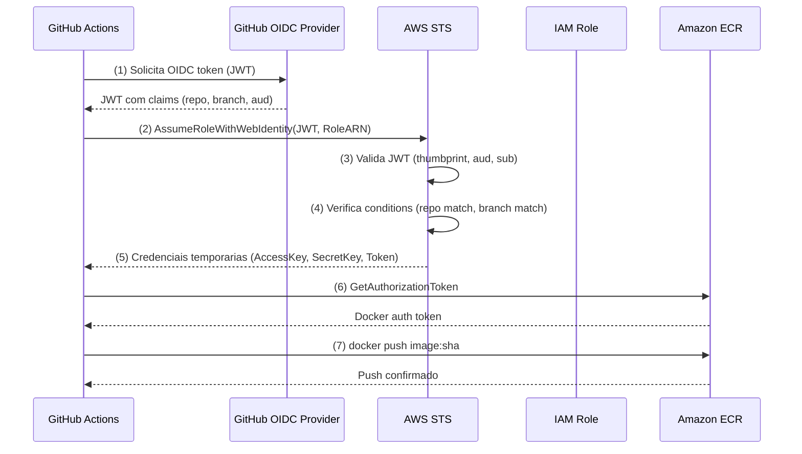

# ADR-004: OIDC Provider + IAM Role para GitHub Actions

**Status**: Aceito
**Data**: 2026-05-17
**Decisores**: Time de infraestrutura / DevOps lead

---

## Sumario Executivo

Criar um OIDC Identity Provider na AWS para `token.actions.githubusercontent.com` e uma IAM Role dedicada que o GitHub Actions assume via `sts:AssumeRoleWithWebIdentity`. A role tera permissoes least-privilege para push de imagens nos dois repositorios ECR existentes (`workshop-backend` e `workshop-frontend`). Zero access keys -- 100% credenciais temporarias via OIDC federation.

---

## Contexto

O pipeline de CI/CD no GitHub Actions precisa autenticar na AWS para:

1. **Push de imagens Docker** nos repositorios ECR (`workshop-backend` e `workshop-frontend`)
2. **Login no ECR** para obter token de autenticacao Docker

Historicamente, isso era feito com access keys (AWS_ACCESS_KEY_ID + AWS_SECRET_ACCESS_KEY) armazenadas como secrets do repositorio. Essa abordagem tem problemas criticos:

- **Credenciais de longa duracao**: access keys nao expiram automaticamente, criando risco de exposicao permanente
- **Rotacao manual**: exige processo operacional para rotacionar periodicamente
- **Blast radius**: se vazadas (logs, PRs publicos, forks), dao acesso ate serem revogadas manualmente
- **Nao rastreavel**: dificil auditar qual workflow especifico usou a credencial

A AWS e o GitHub recomendam oficialmente o uso de OIDC federation como metodo preferido de autenticacao para GitHub Actions.

### Dependencias

- **ECR repositories**: Ja existem no `02-eks-stack` (ADR-003)
- **AWS Account**: 968225077300
- **Regiao**: us-east-1
- **Repositorio GitHub**: `kenerry-serain/wks-ia-preview` (a confirmar)

---

## Decisao

### Arquitetura de Autenticacao

```
GitHub Actions Workflow
        |
        | (1) Solicita OIDC token ao GitHub
        v
GitHub OIDC Provider (token.actions.githubusercontent.com)
        |
        | (2) Emite JWT com claims (repo, branch, workflow)
        v
AWS STS (sts:AssumeRoleWithWebIdentity)
        |
        | (3) Valida JWT contra OIDC Provider registrado na AWS
        | (4) Verifica conditions (repo, branch)
        | (5) Emite credenciais temporarias (15 min - 1 hora)
        v
IAM Role (workshop-github-actions-role)
        |
        | (6) Push de imagem Docker
        v
Amazon ECR (workshop-backend, workshop-frontend)
```

### Componentes AWS

| Componente | Recurso AWS / Terraform | Finalidade |
|---|---|---|
| OIDC Provider | `aws_iam_openid_connect_provider` | Registra o GitHub como identity provider confiavel |
| IAM Role | `aws_iam_role` | Role assumida pelo GitHub Actions via OIDC |
| IAM Policy | `aws_iam_role_policy` (inline) | Permissoes least-privilege para ECR push |

### Restricoes de Seguranca na Trust Policy

| Condition | Valor | Finalidade |
|---|---|---|
| `StringEquals` (aud) | `sts.amazonaws.com` | Garante que o token foi emitido para a AWS |
| `StringLike` (sub) | `repo:kenerry-serain/wks-ia-preview:ref:refs/heads/main` | Restringe a role ao repositorio e branch `main` |

> **Nota**: A condition `StringLike` no `sub` e usada ao inves de `StringEquals` para permitir flexibilidade futura (ex: adicionar outros branches). O formato do subject claim do GitHub e `repo:<owner>/<repo>:ref:refs/heads/<branch>`.

### Permissoes IAM (Least-Privilege)

A policy concede apenas as permissoes necessarias para:
1. Obter token de autenticacao do ECR (`ecr:GetAuthorizationToken`) -- necessario em nivel de conta, nao pode ser scoped a repositorio
2. Push de imagens nos dois repositorios especificos (`ecr:BatchCheckLayerAvailability`, `ecr:InitiateLayerUpload`, `ecr:UploadLayerPart`, `ecr:CompleteLayerUpload`, `ecr:PutImage`)

---

## Estrutura de Arquivos

Os novos recursos serao adicionados ao diretorio `terraform/02-eks-stack/`, mantendo a estrutura existente:

```
terraform/
  02-eks-stack/
    ... (arquivos existentes do ADR-003) ...
    iam.oidc-provider.tf          # OIDC Identity Provider do GitHub  (NOVO)
    iam.github-actions-role.tf    # IAM Role + inline policy para GHA (NOVO)
    variables.tf                  # Adicionar variavel github_actions  (MODIFICADO)
    outputs.tf                    # Adicionar outputs da role e OIDC   (MODIFICADO)
    terraform.tfvars              # Adicionar valores github_actions   (MODIFICADO)
```

**Total de novos arquivos: 2**
**Arquivos modificados: 3** (`variables.tf`, `outputs.tf`, `terraform.tfvars`)

---

## Detalhamento de Cada Arquivo

### 1. `iam.oidc-provider.tf` (NOVO)

```hcl
# ============================================================
# File    : terraform/02-eks-stack/iam.oidc-provider.tf
# ADR     : ADR-004 — OIDC Provider + IAM Role para GitHub Actions
# Author  : DevOps Engineer Agent
# Date    : 2026-05-17
# ============================================================

data "tls_certificate" "github" {
  url = "https://token.actions.githubusercontent.com/.well-known/openid-configuration"
}

resource "aws_iam_openid_connect_provider" "github" {
  url             = "https://token.actions.githubusercontent.com"
  client_id_list  = ["sts.amazonaws.com"]
  thumbprint_list = [data.tls_certificate.github.certificates[0].sha1_fingerprint]

  tags = {
    Name = var.github_actions.oidc_provider_name
  }
}
```

> **Nota sobre `thumbprint_list`**: O data source `tls_certificate` obtem automaticamente o thumbprint do certificado TLS do GitHub OIDC Provider. Isso evita hard-coding de um thumbprint que pode mudar quando o GitHub rotaciona certificados. A AWS tambem valida o certificado de forma independente para OIDC providers que usam thumbprint list.

### 2. `iam.github-actions-role.tf` (NOVO)

```hcl
# ============================================================
# File    : terraform/02-eks-stack/iam.github-actions-role.tf
# ADR     : ADR-004 — OIDC Provider + IAM Role para GitHub Actions
# Author  : DevOps Engineer Agent
# Date    : 2026-05-17
# ============================================================

resource "aws_iam_role" "github_actions" {
  name = var.github_actions.role_name

  assume_role_policy = jsonencode({
    Version = "2012-10-17"
    Statement = [
      {
        Effect = "Allow"
        Principal = {
          Federated = aws_iam_openid_connect_provider.github.arn
        }
        Action = "sts:AssumeRoleWithWebIdentity"
        Condition = {
          StringEquals = {
            "token.actions.githubusercontent.com:aud" = "sts.amazonaws.com"
          }
          StringLike = {
            "token.actions.githubusercontent.com:sub" = "repo:${var.github_actions.repository}:ref:refs/heads/${var.github_actions.branch}"
          }
        }
      }
    ]
  })

  tags = {
    Name = var.github_actions.role_name
  }
}

resource "aws_iam_role_policy" "github_actions_ecr" {
  name = var.github_actions.policy_name
  role = aws_iam_role.github_actions.id

  policy = jsonencode({
    Version = "2012-10-17"
    Statement = [
      {
        Sid    = "AllowECRAuth"
        Effect = "Allow"
        Action = [
          "ecr:GetAuthorizationToken"
        ]
        Resource = "*"
      },
      {
        Sid    = "AllowECRPush"
        Effect = "Allow"
        Action = [
          "ecr:BatchCheckLayerAvailability",
          "ecr:GetDownloadUrlForLayer",
          "ecr:BatchGetImage",
          "ecr:InitiateLayerUpload",
          "ecr:UploadLayerPart",
          "ecr:CompleteLayerUpload",
          "ecr:PutImage"
        ]
        Resource = [
          aws_ecr_repository.backend.arn,
          aws_ecr_repository.frontend.arn
        ]
      }
    ]
  })
}
```

> **Notas**:
> - `ecr:GetAuthorizationToken` tem `Resource = "*"` porque a API do ECR nao suporta resource-level permissions para essa action. Isso e uma limitacao documentada da AWS, nao uma violacao de least-privilege.
> - `ecr:GetDownloadUrlForLayer` e `ecr:BatchGetImage` sao necessarios para Docker layer caching (o `docker build` precisa verificar quais layers ja existem no registry).
> - A policy e inline (`aws_iam_role_policy`) ao inves de managed (`aws_iam_policy` + `aws_iam_role_policy_attachment`) porque e especifica desta role e nao sera compartilhada. Inline policies sao excluidas automaticamente quando a role e destruida.
> - O resource das permissoes de push esta scoped aos ARNs exatos dos dois repositorios ECR, nao a `*`.

### 3. Adicoes em `variables.tf` (MODIFICADO)

Adicionar o seguinte bloco ao final do arquivo `variables.tf` existente:

```hcl
# ---------------------------------------------------------------------------
# GitHub Actions — OIDC federation and IAM role for CI/CD pipelines.
#
# repository format: "<owner>/<repo>" (e.g., "my-org/my-repo")
# branch restricts which branch can assume the role via OIDC subject claim.
# oidc_provider_name is the Name tag for the OIDC provider resource.
# role_name is the IAM role name assumed by GitHub Actions.
# policy_name is the inline policy name for ECR push permissions.
# ---------------------------------------------------------------------------

variable "github_actions" {
  description = "GitHub Actions OIDC federation and IAM role configuration for CI/CD ECR push"
  type = object({
    repository         = string
    branch             = optional(string, "main")
    oidc_provider_name = optional(string, "github-actions-oidc")
    role_name          = string
    policy_name        = optional(string, "github-actions-ecr-push")
  })
  nullable = false
}
```

**Justificativas das decisoes na variavel `github_actions`:**

- `repository` como string obrigatoria: o formato `<owner>/<repo>` e necessario para a condition na trust policy. Sem isso, qualquer repositorio GitHub poderia assumir a role.
- `branch` com default `"main"`: restringe o uso da role ao branch principal. Permite override para cenarios de testing.
- `oidc_provider_name` e `policy_name` com defaults: sao nomes de tags/recursos que raramente mudam.
- `role_name` sem default: nome da role deve ser explicito e unico por projeto.

### 4. Adicoes em `outputs.tf` (MODIFICADO)

Adicionar ao final do arquivo `outputs.tf` existente:

```hcl
# ---------------------------------------------------------------------------
# GitHub Actions OIDC outputs
# ---------------------------------------------------------------------------

output "github_oidc_provider_arn" {
  description = "The ARN of the GitHub OIDC Identity Provider"
  value       = aws_iam_openid_connect_provider.github.arn
}

output "github_actions_iam_role_arn" {
  description = "The ARN of the IAM role for GitHub Actions to assume via OIDC"
  value       = aws_iam_role.github_actions.arn
}
```

### 5. Adicoes em `terraform.tfvars` (MODIFICADO)

Adicionar ao final do arquivo `terraform.tfvars` existente:

```hcl
github_actions = {
  repository         = "kenerry-serain/wks-ia-preview"
  branch             = "main"
  oidc_provider_name = "github-actions-oidc"
  role_name          = "workshop-github-actions-role"
  policy_name        = "github-actions-ecr-push"
}
```

> **IMPORTANTE**: Substituir `kenerry-serain/wks-ia-preview` pelo nome real do repositorio GitHub (ex: `minha-org/meu-repo`) antes de executar `terraform apply`. O valor deve corresponder exatamente ao campo `repository` no GitHub.

---

## Diagrama Mermaid



---

## Justificativa

### 1. OIDC Federation ao inves de Access Keys

OIDC federation elimina completamente credenciais de longa duracao:
- **Credenciais temporarias**: tokens STS expiram em 1 hora (configuravel entre 15 min e 12 horas)
- **Sem secrets para rotacionar**: nao existem access keys para gerenciar
- **Rastreabilidade**: cada assume-role e logado no CloudTrail com o subject claim completo (repo + branch + workflow)
- **Blast radius minimo**: se um token STS vazar, expira automaticamente
- **Metodo recomendado**: tanto a AWS quanto o GitHub recomendam OIDC como metodo preferido

### 2. Inline Policy ao inves de Managed Policy

A policy de ECR push e especifica para esta role e nao sera reutilizada:
- Inline policies sao excluidas automaticamente quando a role e destruida (cleanup automatico)
- Evita managed policies orfas em caso de `terraform destroy`
- Para policies compartilhadas entre roles, managed policies seriam preferidas

### 3. Recursos no 02-eks-stack ao inves de stack separado

Os recursos de OIDC e IAM role estao logicamente acoplados ao EKS/ECR:
- A policy referencia diretamente os ARNs dos repositorios ECR (`aws_ecr_repository.backend.arn`)
- O lifecycle e o mesmo: se o ECR for destruido, a role de push nao faz sentido
- Criar um stack separado exigiria `terraform_remote_state` adicional e duplicacao de outputs

### 4. `tls_certificate` data source ao inves de thumbprint hard-coded

O thumbprint do certificado TLS do GitHub pode mudar durante rotacoes de certificado:
- O data source obtem o thumbprint atual automaticamente a cada `terraform plan`
- Evita falha silenciosa quando o GitHub rotaciona certificados
- Alternativa hard-coded exigiria monitoramento manual de rotacoes

---

## Alternativas Consideradas

### Por que nao Access Keys (AWS_ACCESS_KEY_ID + AWS_SECRET_ACCESS_KEY)

- **Descartado porque**: Credenciais de longa duracao que nunca expiram, requerem rotacao manual, e tem blast radius ilimitado se vazadas. Violar a recomendacao oficial tanto da AWS quanto do GitHub. Em caso de leak (logs, PRs publicos, forks), um atacante tem acesso ate revogacao manual.
- **Quando reconsiderar**: Nunca para GitHub Actions. OIDC e estritamente superior em todos os aspectos.

### Por que nao IAM User dedicado (em vez de role)

- **Descartado porque**: IAM Users geram access keys (longa duracao). Mesmo com rotacao automatica via Secrets Manager, a complexidade adicional e desnecessaria quando OIDC oferece credenciais efemeras nativamente.
- **Quando reconsiderar**: Nunca para CI/CD moderno com providers que suportam OIDC.

### Por que nao Managed Policy ao inves de Inline Policy

- **Descartado porque**: A policy de ECR push e especifica desta role, nao compartilhada. Managed policies criam recursos adicionais que podem ficar orfaos se a role for destruida sem cleanup. Inline policies tem lifecycle acoplado a role.
- **Quando reconsiderar**: Se a mesma policy de ECR push precisar ser atribuida a multiplas roles (ex: role de CI separada de CD).

### Por que nao stack Terraform separado (03-cicd-stack)

- **Descartado porque**: A IAM role de OIDC referencia diretamente os ARNs dos repositorios ECR. Separa-los em stacks diferentes exigiria `terraform_remote_state` para ler os ARNs, adicionando acoplamento e duplicacao sem beneficio. O lifecycle dos recursos e o mesmo.
- **Quando reconsiderar**: Se o projeto crescer com multiplos pipelines, multiplos repos, ou multiplas roles de CI/CD que justifiquem um stack dedicado para IAM/OIDC.

---

## Riscos e Trade-offs

| Risco | Mitigacao | Severidade |
|---|---|---|
| OIDC Provider com thumbprint desatualizado | `tls_certificate` data source atualiza automaticamente. Rodar `terraform plan` periodicamente para detectar mudancas | Baixa (mitigada) |
| Branch condition bypass via PR merge | A condition `StringLike` restringe a `refs/heads/main`. PRs nao-mergeados nao disparam workflows com acesso a role | Baixa (mitigada) |
| `ecr:GetAuthorizationToken` com `Resource = "*"` | Limitacao da API AWS -- nao suporta resource-level permission para essa action. A role so tem permissoes de push nos 2 repos especificos | Baixa (aceita) |
| Repositorio GitHub renomeado quebra a condition | O `sub` claim inclui o nome do repo. Renomear o repo exige update no `terraform.tfvars` | Media (aceita, documentada) |
| Inline policy acoplada a role | Destruir a role remove a policy automaticamente. Isso e o comportamento desejado (cleanup) | Nao aplicavel (design intencional) |
| Fork do repositorio poderia tentar assumir a role | A condition `sub` usa o formato `repo:kenerry-serain/wks-ia-preview:*`, que inclui o owner. Forks tem owner diferente, portanto nao passam na condition | Baixa (mitigada por design) |

### Trade-off aceito: Todos os recursos no mesmo stack

Colocar OIDC + IAM Role no `02-eks-stack` acopla o lifecycle desses recursos ao do cluster EKS/ECR. Se no futuro for necessario gerenciar o OIDC provider independentemente (ex: compartilhar entre multiplos clusters), sera necessario refatorar para um stack separado.

---

## Conformidade com Convencoes do Projeto

Checklist de validacao contra `.claude/rules/terraform-naming.md`:

- [x] Arquivos seguem `<resource>.<sub-resource>.tf` (ex: `iam.oidc-provider.tf`, `iam.github-actions-role.tf`)
- [x] Identificadores Terraform usam `_` (underscore), nunca `-` (ex: `aws_iam_role "github_actions"`)
- [x] Nomes de recursos nao repetem o tipo (ex: `aws_iam_role "github_actions"`, nao `aws_iam_role "github_actions_iam_role"`)
- [x] Substantivos singulares para nomes de recursos
- [x] Zero hard-coded strings em argumentos de recursos -- tudo via `var.github_actions.*` e referencias a recursos
- [x] Variaveis relacionadas agrupadas em `object()` (`var.github_actions.repository`)
- [x] Toda variavel e output tem `description`
- [x] `tags` contem apenas tags resource-specific (`Name`); cross-cutting via `default_tags`
- [x] Outputs seguem `{name}_{type}_{attribute}` (ex: `github_actions_iam_role_arn`)
- [x] `default_tags` configurado no provider com `Project`, `Environment`, `ManagedBy` (existente)

---

## Proximos Passos

1. **Confirmar o nome do repositorio GitHub** (`kenerry-serain/wks-ia-preview`) e atualizar `terraform.tfvars`.
2. **Criar os 2 arquivos novos** (`iam.oidc-provider.tf`, `iam.github-actions-role.tf`).
3. **Atualizar os 3 arquivos existentes** (`variables.tf`, `outputs.tf`, `terraform.tfvars`).
4. **Executar o deploy**: `terraform plan && terraform apply` no `02-eks-stack`.
5. **Testar a autenticacao** com um workflow de teste no GitHub Actions usando `aws-actions/configure-aws-credentials@v4`.

---

## Revisao Recomendada

Reavaliar esta decisao quando:

- O projeto precisar de permissoes adicionais alem de ECR push (ex: deploy no EKS, S3 access) -- expandir a policy inline ou criar policies separadas.
- Multiplos repositorios GitHub precisarem assumir a mesma role -- considerar wildcards ou multiplas conditions no subject.
- O projeto adotar multi-account AWS -- avaliar se o OIDC provider deve ser centralizado na account de management.
- O GitHub alterar o formato dos subject claims -- verificar documentacao do GitHub OIDC.
