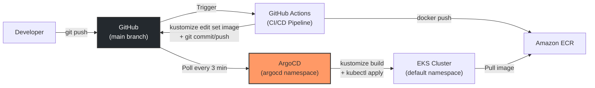

# ADR-006: ArgoCD como Engine de GitOps

**Status**: Aceito
**Data**: 2026-05-17
**Decisores**: Time de infraestrutura / DevOps lead

---

## Sumario Executivo

Instalar o ArgoCD no cluster EKS (`workshop-eks`) via manifests oficiais (`kubectl apply`) e configurar um Application resource apontando para `kubernetes/overlays/production/` no branch `main`. O ArgoCD opera com sincronizacao automatica (`automated sync`), poda de recursos orfaos (`prune: true`), e auto-correcao de drift (`selfHeal: true`). A instalacao e feita via manifests YAML puros, sem Helm chart ou Terraform Helm provider.

---

## Contexto

O projeto precisa de um mecanismo que:

1. **Detecte mudancas** nos manifests Kubernetes no Git (especificamente no overlay de producao)
2. **Aplique automaticamente** essas mudancas no cluster EKS
3. **Corrija drift** quando alguem modifica recursos diretamente no cluster (ex: `kubectl edit`)
4. **Remova recursos orfaos** que foram deletados do Git mas ainda existem no cluster
5. **Forneca visibilidade** sobre o estado de sincronizacao entre Git e cluster

Esse padrao e conhecido como **GitOps**: Git como unica fonte de verdade para o estado desejado da infraestrutura e aplicacoes.

### Dependencias

- **EKS Cluster**: `workshop-eks` v1.32 (ADR-003) -- cluster onde o ArgoCD sera instalado
- **Kustomize Structure**: `kubernetes/overlays/production/` (ADR-005) -- fonte dos manifests
- **GitHub Repository**: `kenerry-serain/wks-ia-preview` -- onde o Git monitora mudancas
- **Namespace**: `argocd` -- namespace dedicado para o ArgoCD

### Pre-requisitos de acesso

- `kubectl` configurado para o cluster: `aws eks update-kubeconfig --region us-east-1 --name workshop-eks`
- Permissoes IAM para executar comandos no cluster (via aws-auth ConfigMap ou EKS access entries)

---

## Decisao

### Arquitetura GitOps

```
Developer
    |
    | (1) git push (codigo da aplicacao)
    v
GitHub Repository (kenerry-serain/wks-ia-preview)
    |
    | (2) GitHub Actions CI/CD (ADR-007)
    |     - Build Docker image
    |     - Push to ECR
    |     - kustomize edit set image (ADR-005)
    |     - git commit + push (atualiza tag no overlay)
    v
Git (kubernetes/overlays/production/kustomization.yaml)
    |
    | (3) ArgoCD detecta mudanca (polling a cada 3 min)
    v
ArgoCD (no cluster EKS)
    |
    | (4) kustomize build + kubectl apply
    v
EKS Cluster (workshop-eks)
    |
    | Pods atualizados com nova imagem
    v
ECR (968225077300.dkr.ecr.us-east-1.amazonaws.com)
```

### Instalacao do ArgoCD

A instalacao segue o metodo oficial recomendado pela documentacao do ArgoCD:

```bash
# 1. Criar namespace dedicado
kubectl create namespace argocd

# 2. Instalar ArgoCD via manifests oficiais (versao estavel)
kubectl apply -n argocd -f https://raw.githubusercontent.com/argoproj/argo-cd/stable/manifests/install.yaml

# 3. Aguardar todos os pods ficarem Ready
kubectl wait --for=condition=Ready pods --all -n argocd --timeout=300s

# 4. Obter a senha inicial do admin
kubectl -n argocd get secret argocd-initial-admin-secret -o jsonpath="{.data.password}" | base64 -d

# 5. Acessar a UI (port-forward para acesso local)
kubectl port-forward svc/argocd-server -n argocd 8080:443
```

> **Nota sobre versao**: O URL `stable/manifests/install.yaml` aponta para a versao estavel mais recente. Para ambientes de producao, fixar a versao: `https://raw.githubusercontent.com/argoproj/argo-cd/v2.13.4/manifests/install.yaml` (substituir pela versao desejada).

### Componentes Instalados

O manifest `install.yaml` instala os seguintes componentes no namespace `argocd`:

| Componente | Tipo | Finalidade |
|---|---|---|
| argocd-server | Deployment | API server + UI web |
| argocd-repo-server | Deployment | Clona repos Git, renderiza manifests (Kustomize, Helm, etc.) |
| argocd-application-controller | StatefulSet | Monitora aplicacoes, detecta drift, executa sync |
| argocd-redis | Deployment | Cache para o server e controller |
| argocd-dex-server | Deployment | SSO / autenticacao externa (opcional) |
| argocd-applicationset-controller | Deployment | Gerencia ApplicationSets (nao usado neste workshop) |
| argocd-notifications-controller | Deployment | Notificacoes (Slack, email, etc. -- nao configurado neste workshop) |

### Application Resource

Apos a instalacao do ArgoCD, criar o recurso `Application` que define o que sincronizar:

```yaml
# argocd/application.yaml
apiVersion: argoproj.io/v1alpha1
kind: Application
metadata:
  name: workshop-apps
  namespace: argocd
  labels:
    app: workshop-apps
    environment: production
    managed-by: argocd
spec:
  project: default

  source:
    repoURL: https://github.com/kenerry-serain/wks-ia-preview.git
    targetRevision: main
    path: kubernetes/overlays/production

  destination:
    server: https://kubernetes.default.svc
    namespace: default

  syncPolicy:
    automated:
      prune: true
      selfHeal: true
    syncOptions:
      - CreateNamespace=false
      - PruneLast=true
```

> **IMPORTANTE**: Substituir `kenerry-serain/wks-ia-preview` pelo nome real do repositorio GitHub antes de aplicar.

Aplicar com:

```bash
kubectl apply -f argocd/application.yaml
```

### Parametros do Application Resource

| Parametro | Valor | Justificativa |
|---|---|---|
| `project` | `default` | Projeto ArgoCD padrao, sem restricoes de namespace ou cluster. Suficiente para workshop com cluster unico |
| `repoURL` | `https://github.com/kenerry-serain/wks-ia-preview.git` | Repositorio Git onde os manifests estao. HTTPS para acesso sem SSH keys |
| `targetRevision` | `main` | Branch monitorado. Mudancas em outros branches sao ignoradas |
| `path` | `kubernetes/overlays/production` | Diretorio do overlay de producao (ADR-005). ArgoCD executa `kustomize build` neste path |
| `destination.server` | `https://kubernetes.default.svc` | Cluster local (in-cluster). ArgoCD esta instalado no mesmo cluster que gerencia |
| `destination.namespace` | `default` | Namespace onde os recursos sao deployados. Os manifests podem sobrescrever isso via `metadata.namespace` |
| `automated.prune` | `true` | Remove recursos do cluster que foram deletados do Git. Sem isso, recursos orfaos persistem indefinidamente |
| `automated.selfHeal` | `true` | Reverte modificacoes manuais no cluster (ex: `kubectl edit`, `kubectl scale`). Garante que Git e a unica fonte de verdade |
| `PruneLast` | `true` | Executa a poda (delete) de recursos orfaos somente apos aplicar todos os novos recursos. Evita downtime durante sync |
| `CreateNamespace` | `false` | Nao cria namespace automaticamente. O namespace `default` ja existe |

### Sync Policy Detalhada

```
automated:
  prune: true       -> Se um manifest for removido do Git, o recurso e deletado do cluster
  selfHeal: true    -> Se alguem modificar um recurso via kubectl, o ArgoCD reverte para o estado do Git

syncOptions:
  PruneLast: true   -> Deleta orfaos somente apos todos os novos recursos serem criados
```

**Fluxo de sincronizacao:**

1. ArgoCD faz polling do repositorio Git a cada 3 minutos (padrao configuravel)
2. Compara o output de `kustomize build kubernetes/overlays/production/` com o estado atual do cluster
3. Se houver diferenca (OutOfSync), aplica as mudancas automaticamente
4. Se `prune: true` e um recurso existe no cluster mas nao no Git, o recurso e deletado
5. Se `selfHeal: true` e um recurso no cluster difere do Git (ex: modificacao manual), o ArgoCD reverte

---

## Diagrama Mermaid



---

## Justificativa

### 1. ArgoCD ao inves de Flux CD

Ambas sao ferramentas CNCF para GitOps, mas ArgoCD e a escolha para este projeto:

| Aspecto | ArgoCD | Flux CD |
|---|---|---|
| Status CNCF | Graduated (2022) | Graduated (2024) |
| UI Web | Nativa, rica, com diff visual | Terceirizada (Weave GitOps UI) |
| Curva de aprendizado | Menor -- UI facilita onboarding | Maior -- CLI-first, requer familiaridade com CRDs |
| Modelo de operacao | Pull-based com Application CRDs | Pull-based com GitRepository + Kustomization CRDs |
| Multi-cluster | Suporte nativo | Suporte nativo |
| Comunidade | Maior (30k+ stars GitHub) | Forte mas menor |
| Debugging | UI mostra diff entre desired/actual | Requer `flux logs` e eventos Kubernetes |

**Decisao**: ArgoCD. A UI web e diferencial para um workshop educacional -- permite visualizar o estado de sincronizacao, diferencas entre Git e cluster, e historico de deployments sem precisar de `kubectl`. O status CNCF Graduated confirma maturidade para producao.

### 2. Instalacao via manifests puros ao inves de Helm Chart

| Metodo | Complexidade | Controle | Reproducibilidade |
|---|---|---|---|
| `kubectl apply -f install.yaml` | Baixa -- um comando | Medio -- usa defaults do ArgoCD | Alta -- URL versionado |
| Helm Chart (`argo-cd`) | Media -- requer Helm instalado, values.yaml | Alto -- cada campo configuravel | Alta -- chart versionado |
| Terraform Helm Provider | Alta -- requer provider config, state | Alto -- mesmo que Helm | Alta -- estado no Terraform |

**Decisao**: Manifests puros (`kubectl apply`). Para um workshop:
- **Um unico comando** instala tudo. Sem dependencia de Helm CLI.
- **Configuracao padrao** do ArgoCD e suficiente para o escopo.
- Se customizacao for necessaria, patches via `kubectl patch` ou manifests adicionais sao suficientes.

### 3. ArgoCD no mesmo cluster ao inves de cluster de management dedicado

| Abordagem | Complexidade | Custo | Isolamento |
|---|---|---|---|
| ArgoCD no mesmo cluster (in-cluster) | Baixa -- `destination.server = kubernetes.default.svc` | Zero adicional | Nenhum (compartilha recursos) |
| ArgoCD em cluster de management | Alta -- networking cross-cluster, IAM cross-account | Alto ($73/mes por cluster adicional) | Total |

**Decisao**: In-cluster. Para 1 cluster com 2 aplicacoes, um cluster de management separado e overkill. O ArgoCD consome poucos recursos (~500Mi RAM total para todos os componentes) e pode coexistir com as aplicacoes no mesmo cluster.

### 4. Repositorio unico (monorepo) ao inves de repos separados para codigo e manifests

| Abordagem | Complexidade | Rastreabilidade | Risco de loop |
|---|---|---|---|
| Monorepo (codigo + manifests) | Baixa -- tudo em um lugar | Alta -- commit do app + manifest na mesma timeline | Precisa de path filters |
| Repos separados (app-repo + config-repo) | Media -- 2 repos para gerenciar, cross-repo dispatch | Fragmentada -- historico dividido | Nenhum -- repos independentes |

**Decisao**: Monorepo. O pipeline usa path filters (`dvn-workshop-apps/backend/**`) que nao incluem `kubernetes/`, evitando loops de trigger. A rastreabilidade e superior (um `git log` mostra tudo). Para equipes maiores, repos separados podem ser necessarios para controle de acesso.

---

## Alternativas Consideradas

### Por que nao Flux CD

- **Descartado porque**: A falta de UI nativa dificulta o aprendizado em um workshop. Flux opera via CRDs (`GitRepository`, `Kustomization`, `HelmRelease`) que adicionam camadas de abstracao. Para um time com 1-2 engenheiros, a curva de aprendizado do ArgoCD e menor.
- **Quando reconsiderar**: Se o time preferir abordagem declarativa pura (CRDs no Git para configurar o Flux), ou se o ArgoCD se tornar heavy demais para o cluster (consumo de recursos).

### Por que nao Helm Chart para instalar ArgoCD

- **Descartado porque**: Adiciona dependencia do Helm CLI e requer um `values.yaml` para customizacao. Para um workshop onde os defaults sao suficientes, `kubectl apply` e mais simples e nao requer ferramentas adicionais.
- **Quando reconsiderar**: Quando for necessario customizar a instalacao do ArgoCD (ex: configurar SSO, resource limits nos pods do ArgoCD, HA mode com multiplas replicas).

### Por que nao Terraform Helm Provider para instalar ArgoCD

- **Descartado porque**: O ArgoCD e um recurso do cluster Kubernetes, nao da infraestrutura AWS. Gerenciar o ArgoCD via Terraform Helm Provider mistura concerns -- o Terraform state passaria a incluir recursos Kubernetes que mudam frequentemente (pods, deployments do ArgoCD). Alem disso, atualizar o ArgoCD exigiria `terraform apply`, que e um processo mais pesado que `kubectl apply`.
- **Quando reconsiderar**: Se todo o gerenciamento do cluster (incluindo add-ons como ArgoCD, cert-manager, ingress controllers) for feito via Terraform como padrao da equipe.

### Por que nao pipeline push-based (sem GitOps engine)

- **Descartado porque**: Um pipeline que executa `kubectl apply` diretamente (push-based) nao detecta drift, nao corrige modificacoes manuais, e nao prune recursos orfaos. O estado desejado existe apenas no momento da execucao do pipeline, nao como estado persistente no Git.
- **Quando reconsiderar**: Nunca para ambientes onde GitOps e viavel. Push-based e aceitavel apenas como fallback temporario.

### Por que nao webhook trigger ao inves de polling

- **Descartado porque**: Webhook requer que o ArgoCD seja acessivel publicamente (ou via ingress com TLS), o que adiciona complexidade de networking e seguranca. O polling de 3 minutos introduz um delay aceitavel para um workshop. A combinacao de polling + webhook e possivel, mas nao necessaria.
- **Quando reconsiderar**: Para producao onde o delay de 3 minutos entre commit e deploy nao e aceitavel. Configurar webhook do GitHub para `argocd-server` via ingress com TLS.

---

## Riscos e Trade-offs

| Risco | Mitigacao | Severidade |
|---|---|---|
| ArgoCD consome recursos do cluster de aplicacoes | Pods do ArgoCD consomem ~500Mi RAM total. Com 2 nodes t3.medium (4Gi cada), sobra capacidade suficiente. Monitorar via `kubectl top pods -n argocd` | Media (aceita) |
| Senha admin inicial em plain text no cluster | Secret `argocd-initial-admin-secret` e automaticamente criado. Alterar senha apos primeiro login e deletar o secret: `kubectl -n argocd delete secret argocd-initial-admin-secret` | Media (mitigavel) |
| Repositorio publico expoe manifests | Os manifests nao contem secrets. Configuracoes sensiveis devem usar Sealed Secrets, SOPS, ou External Secrets Operator. Para o workshop, nao ha secrets nos manifests | Media (aceita) |
| `selfHeal: true` reverte mudancas de debugging | Mudancas manuais via `kubectl` sao revertidas pelo ArgoCD. Para debugging, desabilitar temporariamente o auto-sync via UI ou `argocd app set workshop-apps --sync-policy none` | Baixa (design intencional) |
| Polling delay de 3 minutos | Aceitavel para workshop. Para reducao, configurar webhook ou diminuir o intervalo de polling | Baixa (aceita) |
| ArgoCD sem HA (single replica) | Instalacao padrao usa 1 replica de cada componente. Se um pod do ArgoCD cair, a sincronizacao para ate o restart. Nao afeta os workloads ja deployados | Baixa (aceita para workshop) |
| Repositorio monorepo pode expor manifests de producao em PRs | Path filters e branch protection no GitHub mitigam. PRs nao afetam o ArgoCD (que monitora `main`) | Baixa (mitigada) |

### Trade-off aceito: Simplicidade vs. Seguranca

A instalacao padrao do ArgoCD nao inclui TLS no ingress (acessivel via port-forward), nao configura SSO (usa admin local), e nao habilita RBAC granular. Para um workshop, isso simplifica o setup. Para producao, todos esses aspectos devem ser configurados.

### Trade-off aceito: Polling vs. Webhook

O polling de 3 minutos adiciona latencia entre o commit e o deploy. Para um workshop onde deploys nao sao time-critical, isso e aceitavel. A configuracao de webhook exigiria ingress com TLS e DNS, que esta fora do escopo.

---

## Procedimento de Instalacao Completo

```bash
# =============================================
# 1. Pre-requisitos
# =============================================

# Configurar kubectl para o cluster EKS
aws eks update-kubeconfig --region us-east-1 --name workshop-eks

# Verificar conectividade
kubectl cluster-info
kubectl get nodes

# =============================================
# 2. Instalar ArgoCD
# =============================================

# Criar namespace
kubectl create namespace argocd

# Instalar via manifests oficiais
kubectl apply -n argocd -f https://raw.githubusercontent.com/argoproj/argo-cd/stable/manifests/install.yaml

# Aguardar pods ficarem Ready (timeout 5 min)
kubectl wait --for=condition=Ready pods --all -n argocd --timeout=300s

# Verificar instalacao
kubectl get pods -n argocd
kubectl get svc -n argocd

# =============================================
# 3. Acessar ArgoCD UI
# =============================================

# Obter senha inicial do admin
kubectl -n argocd get secret argocd-initial-admin-secret -o jsonpath="{.data.password}" | base64 -d && echo

# Port-forward para acesso local
kubectl port-forward svc/argocd-server -n argocd 8080:443

# Acessar: https://localhost:8080
# Usuario: admin
# Senha: (obtida acima)

# =============================================
# 4. Criar Application
# =============================================

# Aplicar o recurso Application
kubectl apply -f argocd/application.yaml

# Verificar status
kubectl get applications -n argocd
kubectl describe application workshop-apps -n argocd

# =============================================
# 5. Verificacao pos-instalacao
# =============================================

# O ArgoCD deve detectar os manifests em kubernetes/overlays/production/
# e sincronizar automaticamente com o cluster.
# Verificar na UI ou via kubectl:
kubectl get applications -n argocd -o wide
```

---

## Proximos Passos

1. **Confirmar o nome do repositorio GitHub** (`kenerry-serain/wks-ia-preview`) e atualizar o `application.yaml`.
2. **Instalar o ArgoCD** seguindo o procedimento acima.
3. **Criar o arquivo `argocd/application.yaml`** no repositorio.
4. **Configurar o GitHub Actions** (ADR-007) para completar o loop de CI/CD.
5. **Validar o fluxo end-to-end**: commit -> pipeline -> ECR push -> tag update -> ArgoCD sync -> pods atualizados.

---

## Revisao Recomendada

Reavaliar esta decisao quando:

- O time crescer e precisar de SSO/RBAC granular (configurar Dex + OIDC com GitHub ou Google).
- Multiplos clusters forem gerenciados (avaliar ArgoCD ApplicationSets ou cluster de management dedicado).
- O delay de polling de 3 minutos nao for aceitavel (configurar webhook do GitHub).
- O ArgoCD consumir recursos demais no cluster (avaliar ArgoCD em cluster separado ou Flux CD como alternativa mais leve).
- Secrets forem necessarios nos manifests (avaliar Sealed Secrets, SOPS, ou External Secrets Operator).
- HA for necessario (configurar ArgoCD com multiplas replicas e Redis HA).
