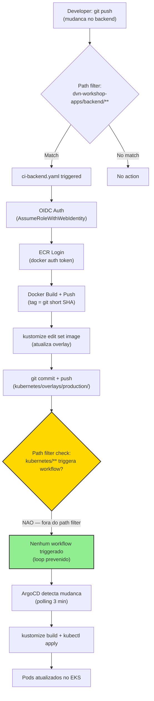

# ADR-007: Pipeline CI/CD com GitHub Actions

**Status**: Aceito
**Data**: 2026-05-17
**Decisores**: Time de infraestrutura / DevOps lead

---

## Sumario Executivo

Criar dois workflows separados no GitHub Actions (`ci-backend.yaml` e `ci-frontend.yaml`) com path filters para CI/CD independente de cada aplicacao. O fluxo e: autenticacao OIDC na AWS (ADR-004) -> login no ECR -> docker build/push (tag = git short SHA) -> `kustomize edit set image` no overlay de producao (ADR-005) -> git commit/push. O ArgoCD (ADR-006) detecta a mudanca e sincroniza com o cluster. Nao ha risco de loop infinito porque path filters excluem o diretorio `kubernetes/`.

---

## Contexto

O projeto precisa de pipelines de CI/CD que:

1. **Buildem imagens Docker** automaticamente quando o codigo da aplicacao muda
2. **Pushm imagens para o ECR** com tags unicas e imutaveis
3. **Atualizem os manifests Kubernetes** para que o ArgoCD aplique a nova versao
4. **Operem independentemente** -- mudancas no backend nao devem triggerar build do frontend e vice-versa
5. **Nao criem loops** -- o commit de atualizacao de tag nao deve re-triggerar o pipeline
6. **Nao usem access keys** -- autenticacao via OIDC (ADR-004)

### Dependencias

- **OIDC Provider + IAM Role**: ADR-004 (autenticacao AWS sem access keys)
- **Kustomize Structure**: ADR-005 (atualizacao de image tags via `kustomize edit set image`)
- **ArgoCD**: ADR-006 (sincronizacao automatica Git -> cluster)
- **ECR Repositories**: `workshop-backend` e `workshop-frontend` no account 968225077300
- **Dockerfiles**: Devem existir em `dvn-workshop-apps/backend/YoutubeLiveApp/Dockerfile` e `dvn-workshop-apps/frontend/youtube-live-app/Dockerfile`

---

## Decisao

### Arquitetura do Pipeline

```
Developer
    |
    | (1) git push (mudanca no codigo do backend ou frontend)
    v
GitHub Actions
    |
    | (2) Path filter: dvn-workshop-apps/backend/** ou dvn-workshop-apps/frontend/**
    v
Workflow triggered (ci-backend.yaml OU ci-frontend.yaml)
    |
    | (3) OIDC auth -> AssumeRoleWithWebIdentity -> credenciais temporarias
    | (4) ECR login -> docker auth token
    | (5) docker build -> docker push (tag = git short SHA)
    | (6) kustomize edit set image (atualiza overlay)
    | (7) git commit + push (kubernetes/overlays/production/kustomization.yaml)
    |
    | NOTA: commit em kubernetes/** NAO re-triggera o pipeline
    |       (path filter exclui este diretorio)
    v
ArgoCD detecta mudanca (polling 3 min)
    |
    | (8) kustomize build + kubectl apply
    v
EKS Cluster (pods atualizados com nova imagem)
```

### Estrategia de Tagging: Git Short SHA

| Estrategia | Unicidade | Imutabilidade | Rastreabilidade | Escolha |
|---|---|---|---|---|
| `latest` | Nao | Nao (muta a cada push) | Nenhuma (qual commit?) | Descartado |
| Semantic Versioning (`v1.2.3`) | Sim | Sim | Media (precisa de changelog) | Descartado |
| Git Short SHA (`abc1234`) | Sim (7 chars, colisao improvavel) | Sim | Alta (link direto ao commit) | **Adotado** |
| Git Full SHA | Sim (absoluta) | Sim | Alta | Descartado (40 chars e verbose demais) |
| Timestamp (`20260517-143022`) | Sim | Sim | Baixa (nao linkavel ao commit) | Descartado |

**Decisao**: Git short SHA (primeiros 7 caracteres do commit hash). Motivos:
- **Unico**: probabilidade de colisao e ~1 em 268 milhoes
- **Imutavel**: cada commit hash e unico e permanente
- **Rastreavel**: `git show abc1234` mostra exatamente o codigo que gerou a imagem
- **Curto**: 7 caracteres e pratico para tags, logs, e debugging

### Path Filters e Prevencao de Loop

| Workflow | Path Filter (trigger) | Commit Path (output) | Loop? |
|---|---|---|---|
| `ci-backend.yaml` | `dvn-workshop-apps/backend/**` | `kubernetes/overlays/production/kustomization.yaml` | Nao |
| `ci-frontend.yaml` | `dvn-workshop-apps/frontend/**` | `kubernetes/overlays/production/kustomization.yaml` | Nao |

**Por que nao ha loop**: o pipeline faz commit em `kubernetes/overlays/production/kustomization.yaml`, mas os path filters monitoram apenas `dvn-workshop-apps/backend/**` e `dvn-workshop-apps/frontend/**`. O diretorio `kubernetes/` esta fora do path filter, portanto o commit do pipeline nao re-triggera nenhum workflow.

### Race Condition e Mitigacao

Cenario: backend e frontend sao pushados simultaneamente. Ambos os workflows tentam modificar e comitar o mesmo arquivo (`kustomization.yaml`).

**Mitigacao**: retry com `git pull --rebase`:

```
Workflow A: kustomize edit set image (backend) -> git commit -> git push (sucesso)
Workflow B: kustomize edit set image (frontend) -> git commit -> git push (FALHA: non-fast-forward)
         -> git pull --rebase -> git push (sucesso)
```

O `git pull --rebase` resolve o conflito porque:
1. Ambos os workflows modificam campos diferentes no `kustomization.yaml` (backend vs frontend image tag)
2. `git rebase` re-aplica o commit local sobre o commit remoto
3. YAML nao conflita porque as linhas de `newTag` sao em entradas `images` diferentes

---

## Workflows

### `ci-backend.yaml`

```yaml
# .github/workflows/ci-backend.yaml
name: CI/CD Backend

on:
  push:
    branches:
      - main
    paths:
      - 'dvn-workshop-apps/backend/**'

permissions:
  id-token: write   # Necessario para OIDC (AssumeRoleWithWebIdentity)
  contents: write   # Necessario para git push (commit de tag update)

env:
  AWS_REGION: us-east-1
  ECR_REGISTRY: 968225077300.dkr.ecr.us-east-1.amazonaws.com
  ECR_REPOSITORY: workshop-backend
  IMAGE_NAME: 968225077300.dkr.ecr.us-east-1.amazonaws.com/workshop-backend

jobs:
  build-and-deploy:
    name: Build, Push, and Update Manifests
    runs-on: ubuntu-latest

    steps:
      # -----------------------------------------------
      # 1. Checkout do repositorio
      # -----------------------------------------------
      - name: Checkout repository
        uses: actions/checkout@v4
        with:
          token: ${{ secrets.GITHUB_TOKEN }}

      # -----------------------------------------------
      # 2. Autenticacao AWS via OIDC (ADR-004)
      # -----------------------------------------------
      - name: Configure AWS credentials via OIDC
        uses: aws-actions/configure-aws-credentials@v4
        with:
          role-to-assume: arn:aws:iam::968225077300:role/workshop-github-actions-role
          aws-region: ${{ env.AWS_REGION }}

      # -----------------------------------------------
      # 3. Login no ECR
      # -----------------------------------------------
      - name: Login to Amazon ECR
        id: ecr-login
        uses: aws-actions/amazon-ecr-login@v2

      # -----------------------------------------------
      # 4. Gerar tag da imagem (git short SHA)
      # -----------------------------------------------
      - name: Generate image tag
        id: image-tag
        run: echo "tag=$(git rev-parse --short HEAD)" >> "$GITHUB_OUTPUT"

      # -----------------------------------------------
      # 5. Build e push da imagem Docker
      # -----------------------------------------------
      - name: Build and push Docker image
        uses: docker/build-push-action@v6
        with:
          context: dvn-workshop-apps/backend/YoutubeLiveApp
          push: true
          tags: ${{ env.IMAGE_NAME }}:${{ steps.image-tag.outputs.tag }}

      # -----------------------------------------------
      # 6. Atualizar image tag no overlay de producao
      # -----------------------------------------------
      - name: Update Kustomize image tag
        run: |
          cd kubernetes/overlays/production
          kustomize edit set image ${{ env.IMAGE_NAME }}:${{ steps.image-tag.outputs.tag }}

      # -----------------------------------------------
      # 7. Commit e push da atualizacao de tag
      # -----------------------------------------------
      - name: Commit and push manifest update
        run: |
          git config user.name "github-actions[bot]"
          git config user.email "github-actions[bot]@users.noreply.github.com"

          git add kubernetes/overlays/production/kustomization.yaml
          git commit -m "chore(backend): update image tag to ${{ steps.image-tag.outputs.tag }}"

          # Retry com rebase para mitigar race condition
          MAX_RETRIES=3
          RETRY_COUNT=0
          until git push; do
            RETRY_COUNT=$((RETRY_COUNT + 1))
            if [ "$RETRY_COUNT" -ge "$MAX_RETRIES" ]; then
              echo "ERROR: Failed to push after $MAX_RETRIES retries"
              exit 1
            fi
            echo "Push failed (attempt $RETRY_COUNT/$MAX_RETRIES). Pulling with rebase..."
            git pull --rebase
          done
```

### `ci-frontend.yaml`

```yaml
# .github/workflows/ci-frontend.yaml
name: CI/CD Frontend

on:
  push:
    branches:
      - main
    paths:
      - 'dvn-workshop-apps/frontend/**'

permissions:
  id-token: write   # Necessario para OIDC (AssumeRoleWithWebIdentity)
  contents: write   # Necessario para git push (commit de tag update)

env:
  AWS_REGION: us-east-1
  ECR_REGISTRY: 968225077300.dkr.ecr.us-east-1.amazonaws.com
  ECR_REPOSITORY: workshop-frontend
  IMAGE_NAME: 968225077300.dkr.ecr.us-east-1.amazonaws.com/workshop-frontend

jobs:
  build-and-deploy:
    name: Build, Push, and Update Manifests
    runs-on: ubuntu-latest

    steps:
      # -----------------------------------------------
      # 1. Checkout do repositorio
      # -----------------------------------------------
      - name: Checkout repository
        uses: actions/checkout@v4
        with:
          token: ${{ secrets.GITHUB_TOKEN }}

      # -----------------------------------------------
      # 2. Autenticacao AWS via OIDC (ADR-004)
      # -----------------------------------------------
      - name: Configure AWS credentials via OIDC
        uses: aws-actions/configure-aws-credentials@v4
        with:
          role-to-assume: arn:aws:iam::968225077300:role/workshop-github-actions-role
          aws-region: ${{ env.AWS_REGION }}

      # -----------------------------------------------
      # 3. Login no ECR
      # -----------------------------------------------
      - name: Login to Amazon ECR
        id: ecr-login
        uses: aws-actions/amazon-ecr-login@v2

      # -----------------------------------------------
      # 4. Gerar tag da imagem (git short SHA)
      # -----------------------------------------------
      - name: Generate image tag
        id: image-tag
        run: echo "tag=$(git rev-parse --short HEAD)" >> "$GITHUB_OUTPUT"

      # -----------------------------------------------
      # 5. Build e push da imagem Docker
      # -----------------------------------------------
      - name: Build and push Docker image
        uses: docker/build-push-action@v6
        with:
          context: dvn-workshop-apps/frontend/youtube-live-app
          push: true
          tags: ${{ env.IMAGE_NAME }}:${{ steps.image-tag.outputs.tag }}

      # -----------------------------------------------
      # 6. Atualizar image tag no overlay de producao
      # -----------------------------------------------
      - name: Update Kustomize image tag
        run: |
          cd kubernetes/overlays/production
          kustomize edit set image ${{ env.IMAGE_NAME }}:${{ steps.image-tag.outputs.tag }}

      # -----------------------------------------------
      # 7. Commit e push da atualizacao de tag
      # -----------------------------------------------
      - name: Commit and push manifest update
        run: |
          git config user.name "github-actions[bot]"
          git config user.email "github-actions[bot]@users.noreply.github.com"

          git add kubernetes/overlays/production/kustomization.yaml
          git commit -m "chore(frontend): update image tag to ${{ steps.image-tag.outputs.tag }}"

          # Retry com rebase para mitigar race condition
          MAX_RETRIES=3
          RETRY_COUNT=0
          until git push; do
            RETRY_COUNT=$((RETRY_COUNT + 1))
            if [ "$RETRY_COUNT" -ge "$MAX_RETRIES" ]; then
              echo "ERROR: Failed to push after $MAX_RETRIES retries"
              exit 1
            fi
            echo "Push failed (attempt $RETRY_COUNT/$MAX_RETRIES). Pulling with rebase..."
            git pull --rebase
          done
```

### Detalhamento dos Steps

| Step | Action/Comando | Finalidade | Notas |
|---|---|---|---|
| Checkout | `actions/checkout@v4` | Clona o repositorio com historico completo | `token: GITHUB_TOKEN` permite push de volta |
| OIDC Auth | `aws-actions/configure-aws-credentials@v4` | Assume IAM Role via OIDC federation | Sem access keys. Credenciais temporarias (~1 hora) |
| ECR Login | `aws-actions/amazon-ecr-login@v2` | Obtem token Docker para push no ECR | Token valido por 12 horas |
| Image Tag | `git rev-parse --short HEAD` | Gera tag unica baseada no commit SHA | 7 caracteres. Imutavel e rastreavel |
| Docker Build | `docker/build-push-action@v6` | Build e push em um step unico | Context aponta para diretorio do Dockerfile |
| Kustomize | `kustomize edit set image` | Atualiza tag no overlay de producao | Semantico, idempotente, preserva formatacao |
| Git Push | `git commit` + retry loop | Commita a atualizacao de tag e pusha | Retry com rebase para race conditions |

### Permissions

```yaml
permissions:
  id-token: write   # Obrigatorio para OIDC
  contents: write   # Obrigatorio para git push
```

| Permission | Finalidade | Por que e necessaria |
|---|---|---|
| `id-token: write` | Solicitar OIDC token ao GitHub | Sem isso, `aws-actions/configure-aws-credentials` nao consegue gerar o JWT para `AssumeRoleWithWebIdentity` |
| `contents: write` | Push de commits para o repositorio | Sem isso, o `git push` da atualizacao de tag falha com erro de permissao |

> **Nota de seguranca**: `contents: write` permite que o workflow modifique qualquer arquivo do repositorio. Isso e mitigado pelo fato de que apenas workflows no branch `main` sao executados (definido no trigger `on.push.branches`), e o conteudo do commit e deterministico (apenas `kustomization.yaml`).

---

## Diagrama Mermaid



---

## Justificativa

### 1. Dois workflows separados ao inves de um workflow unico com matrix

| Abordagem | Complexidade | Independencia | Clareza |
|---|---|---|---|
| Dois workflows separados | Baixa -- YAML simples e direto | Total -- cada app tem seu ciclo de vida | Alta -- nome do workflow indica qual app |
| Um workflow com matrix strategy | Media -- matrix config, conditional steps | Parcial -- ambos rodam se o path matchear | Media -- precisa inspecionar a matrix para saber qual app |
| Um workflow com conditional jobs | Media -- `if` conditions em cada job | Total -- mas mais complexo | Baixa -- logica espalhada em conditions |

**Decisao**: Dois workflows separados. Para 2 aplicacoes, a duplicacao e minima e a clareza e maxima. Cada workflow e auto-contido e pode ser modificado independentemente.

### 2. Git short SHA ao inves de semantic versioning

| Aspecto | Git Short SHA | Semantic Version |
|---|---|---|
| Automacao | Automatico -- `git rev-parse --short HEAD` | Manual -- alguem precisa decidir se e major, minor, ou patch |
| Rastreabilidade | Direta -- `git show abc1234` mostra o codigo | Indireta -- precisa de changelog ou tag annotation |
| CI/CD overhead | Zero -- derivado automaticamente do commit | Significativo -- requer logica de bump (conventional commits, release-please, etc.) |
| Comunicacao | Tecnica -- SHA nao e legivel por humanos | Semantica -- `v2.0.0` comunica breaking change |

**Decisao**: Git short SHA. Para um pipeline de CD automatizado, a rastreabilidade direta ao commit e mais valiosa que a semantica de versao. Cada imagem pode ser mapeada inequivocamente ao codigo que a gerou.

### 3. `docker/build-push-action` ao inves de `docker build` + `docker push` manuais

| Abordagem | Cache | Multi-platform | Logging |
|---|---|---|---|
| `docker/build-push-action@v6` | BuildKit cache layers nativo | Suportado via `platforms` | Structured output |
| `docker build` + `docker push` | Manual (requer `--cache-from`) | Manual | Basico |

**Decisao**: `docker/build-push-action@v6`. Abstrai configuracao de BuildKit, cache, e multi-platform. E mantido oficialmente pelo Docker.

### 4. `GITHUB_TOKEN` ao inves de PAT para git push

| Token | Permissoes | Lifecycle | Workflow trigger |
|---|---|---|---|
| `GITHUB_TOKEN` | Scoped ao repositorio e workflow | Expira ao final do job | Nao triggera outros workflows |
| Personal Access Token (PAT) | Configuraveis (potencialmente amplas) | Longa duracao | Pode triggerar outros workflows |

**Decisao**: `GITHUB_TOKEN`. Alem de ser mais seguro (scoped e efemero), commits feitos com `GITHUB_TOKEN` **nao trigeram outros workflows** por design do GitHub Actions. Isso adiciona uma camada extra de protecao contra loops, alem dos path filters.

### 5. Retry com `git pull --rebase` ao inves de locking

| Abordagem | Complexidade | Confiabilidade | Overhead |
|---|---|---|---|
| Retry com rebase | Baixa -- bash loop simples | Alta -- funciona para conflitos nao-overlapping | Zero -- nao requer infra adicional |
| Concurrency group (`concurrency:`) | Baixa -- YAML nativo do GitHub Actions | Media -- serializa mas pode cancelar runs | Pode descartar builds validos |
| External lock (Redis, DynamoDB) | Alta -- infra adicional | Alta | Significativo -- novo recurso para gerenciar |

**Decisao**: Retry com rebase. Os dois workflows modificam linhas diferentes do `kustomization.yaml` (entradas `images` diferentes), portanto o rebase resolve automaticamente. O limite de 3 retries evita loops infinitos em caso de conflito real.

---

## Alternativas Consideradas

### Por que nao um unico workflow com matrix strategy

- **Descartado porque**: Um workflow unico com matrix `["backend", "frontend"]` e conditional steps (`if: matrix.app == 'backend'`) adiciona complexidade sem beneficio. Os path filters nao podem ser condicionados por matrix, entao ambas as apps seriam buildadas em cada push. A separacao em 2 workflows garante que apenas a app modificada e buildada.
- **Quando reconsiderar**: Se o numero de aplicacoes crescer para 5+, considerar um workflow reutilizavel (reusable workflow) chamado com parametros.

### Por que nao semantic versioning automatico (ex: release-please)

- **Descartado porque**: Semantic versioning requer convencoes de commit (conventional commits), ferramentas de bump (release-please, semantic-release), e decisoes sobre major/minor/patch. Para um pipeline de CD contanuo, o git SHA e suficiente e nao requer overhead adicional.
- **Quando reconsiderar**: Se o projeto precisar comunicar breaking changes externamente (API publica, SDK), ou se clients precisarem saber "em qual versao estou?".

### Por que nao GitHub Actions concurrency groups

- **Descartado porque**: `concurrency: group: deploy / cancel-in-progress: true` cancela workflows em andamento quando um novo e triggerado. Isso pode descartar builds validos. O retry com rebase e mais seguro: ambos os builds completam, e o segundo faz rebase sobre o primeiro.
- **Quando reconsiderar**: Se a race condition se tornar frequente (muitos pushes simultaneos) e o retry com rebase nao for suficiente.

### Por que nao ArgoCD Image Updater (eliminar o commit-back)

- **Descartado porque**: O ArgoCD Image Updater monitora registries e atualiza tags automaticamente, eliminando a necessidade do step de `kustomize edit set image` + `git push`. Porem, isso remove a rastreabilidade no Git (a mudanca de tag nao aparece como commit) e adiciona um componente extra no cluster. O fluxo explicito (commit no Git) e mais didatico e auditavel.
- **Quando reconsiderar**: Para producao com muitos microservicos onde o commit-back pattern se torna gargalo ou fonte de conflitos frequentes.

### Por que nao Jenkins, GitLab CI, ou CircleCI

- **Descartado porque**: O repositorio esta no GitHub. GitHub Actions e integrado nativamente (OIDC, path filters, GITHUB_TOKEN, branch protection), nao requer infra adicional (Jenkins server, GitLab runner), e e gratuito para repositorios publicos (ou com 2000 min/mes para privados no free tier).
- **Quando reconsiderar**: Se o time ja tiver infra de CI/CD existente (ex: Jenkins com pipelines complexos), migrar nao faz sentido apenas para este projeto.

---

## Riscos e Trade-offs

| Risco | Mitigacao | Severidade |
|---|---|---|
| Race condition: 2 workflows pushando simultaneamente | Retry com `git pull --rebase` (3 tentativas). Linhas diferentes no YAML = rebase automatico | Media (mitigada) |
| Loop infinito: commit do pipeline re-triggera workflow | Path filters excluem `kubernetes/`. Commits com `GITHUB_TOKEN` nao trigeram workflows (dupla protecao) | Alta (mitigada por design) |
| Imagem publicada no ECR mas tag nao atualizada no Git (falha no push) | Retry 3x. Se falhar todas, a imagem fica no ECR sem ser deployada. Proximo push valido corrige | Media (aceita) |
| Git short SHA colisao (2 commits com mesmo short hash) | Probabilidade ~1/268M. Para projetos com menos de 100k commits, risco e negligivel. Se necessario, usar 8+ caracteres | Baixa (aceita) |
| `contents: write` permite modificar qualquer arquivo | Mitigado por: workflow roda apenas em `main`, commit e deterministico (apenas kustomization.yaml), branch protection pode restringir | Media (aceita) |
| Kustomize nao instalado no runner | Ubuntu `latest` runners do GitHub Actions incluem Kustomize. Se nao disponivel, adicionar step com `setup-kustomize` action | Baixa (mitigavel) |
| Docker build falha mas workflow continua | `docker/build-push-action` falha o step se o build falhar. Steps subsequentes nao executam (behavior padrao do GitHub Actions) | Nao aplicavel (mitigado por design) |

### Trade-off aceito: Commit-back pattern

O pipeline faz `git push` para atualizar a tag de imagem. Isso e o padrao mais comum para GitOps com Kustomize, mas adiciona complexidade (retry, race condition, permissions de write). A alternativa (ArgoCD Image Updater) elimina o commit-back mas perde rastreabilidade no Git.

### Trade-off aceito: Sem testes no pipeline

Os workflows atuais nao incluem steps de teste (unit tests, integration tests, linting). Para um workshop, o foco e no fluxo de CI/CD. Em producao, adicionar jobs de teste **antes** do job de build, com o build condicionado ao sucesso dos testes.

---

## Fases de Implementacao

A implementacao do plano completo de CD/GitOps segue esta ordem, com dependencias explicitas:

```
Fase 1: Terraform (OIDC + IAM Role)          ← Pre-requisito para tudo
   |
   |  terraform plan && terraform apply
   |  (cria OIDC provider + IAM role no AWS)
   v
Fase 2: Kustomize Restructuring              ← Ja implementada (ADR-005)
   |
   |  Estrutura base/ + overlays/production/
   |  ja existe no repositorio
   v
Fase 3: ArgoCD Installation                  ← Depende do EKS estar operacional
   |
   |  kubectl apply (instala ArgoCD)
   |  kubectl apply (cria Application resource)
   v
Fase 4: GitHub Actions Workflows             ← Depende de Fase 1 (OIDC) + Fase 2 (Kustomize)
   |
   |  Criar .github/workflows/ci-backend.yaml
   |  Criar .github/workflows/ci-frontend.yaml
   v
Fase 5: Validacao End-to-End                 ← Depende de todas as fases anteriores
   |
   |  Push de mudanca no codigo
   |  Verificar: build -> ECR push -> tag update -> ArgoCD sync -> pod update
```

### Detalhamento das Fases

| Fase | Acao | Verificacao de Sucesso |
|---|---|---|
| 1 | `terraform apply` no `02-eks-stack` (novos arquivos OIDC) | `aws iam list-open-id-connect-providers` mostra o provider. `aws iam get-role --role-name workshop-github-actions-role` retorna a role |
| 2 | Ja implementada | `kustomize build kubernetes/overlays/production/` renderiza manifests com image overrides |
| 3 | `kubectl apply -n argocd -f install.yaml` + `kubectl apply -f argocd/application.yaml` | `kubectl get applications -n argocd` mostra `workshop-apps` com status `Synced` |
| 4 | Criar workflows em `.github/workflows/` | Push de mudanca em `dvn-workshop-apps/backend/` triggera o workflow `ci-backend.yaml` |
| 5 | Push de mudanca real e observar o fluxo completo | Pod no cluster esta rodando a imagem com a tag do commit mais recente |

### Validacao End-to-End (Fase 5)

```bash
# 1. Fazer uma mudanca no backend
echo "// test change" >> dvn-workshop-apps/backend/YoutubeLiveApp/Program.cs
git add . && git commit -m "test: trigger CI/CD pipeline" && git push

# 2. Verificar GitHub Actions
# Acessar: https://github.com/kenerry-serain/wks-ia-preview/actions
# Workflow "CI/CD Backend" deve estar em execucao

# 3. Verificar ECR (apos workflow concluir)
aws ecr describe-images \
  --repository-name workshop-backend \
  --region us-east-1 \
  --query 'imageDetails[*].imageTags' \
  --output table

# 4. Verificar kustomization.yaml (tag atualizada)
cat kubernetes/overlays/production/kustomization.yaml
# newTag deve ser o git short SHA do commit

# 5. Verificar ArgoCD (sync status)
kubectl get applications -n argocd
# Status deve ser "Synced" e "Healthy"

# 6. Verificar pods (imagem atualizada)
kubectl get pods -o jsonpath='{.items[*].spec.containers[*].image}'
# Deve mostrar a imagem com a tag do commit
```

---

## Proximos Passos

1. **Implementar Fase 1**: Criar os arquivos Terraform de OIDC (ADR-004) e executar `terraform apply`.
2. **Implementar Fase 3**: Instalar o ArgoCD no cluster (ADR-006).
3. **Criar os workflows**: `.github/workflows/ci-backend.yaml` e `.github/workflows/ci-frontend.yaml`.
4. **Confirmar o nome do repositorio GitHub** (`kenerry-serain/wks-ia-preview`) e atualizar todos os placeholders.
5. **Executar validacao end-to-end** (Fase 5) para confirmar que o loop completo funciona.

---

## Revisao Recomendada

Reavaliar esta decisao quando:

- O numero de aplicacoes crescer para 5+ (considerar reusable workflows com parametros).
- Testes automatizados forem adicionados (inserir jobs de teste antes do build).
- O commit-back pattern causar race conditions frequentes (considerar ArgoCD Image Updater ou concurrency groups).
- Multi-environment for necessario (adicionar workflows para staging/dev com overlays separados).
- Rollback automatico for necessario (integrar com ArgoCD rollback ou adicionar smoke tests pos-deploy).
- A equipe precisar de aprovacao pre-deploy (adicionar GitHub Environments com required reviewers).
